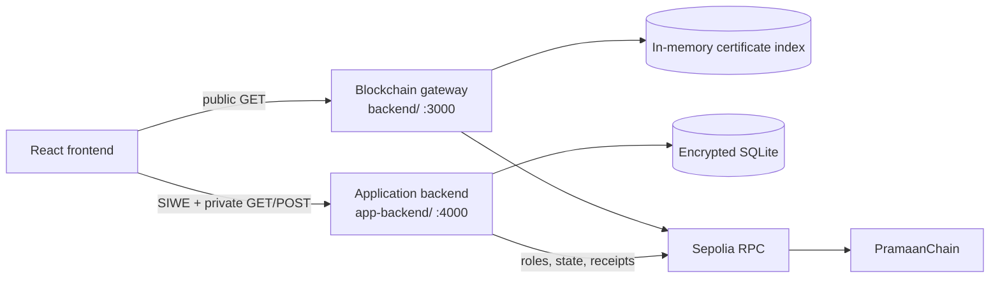
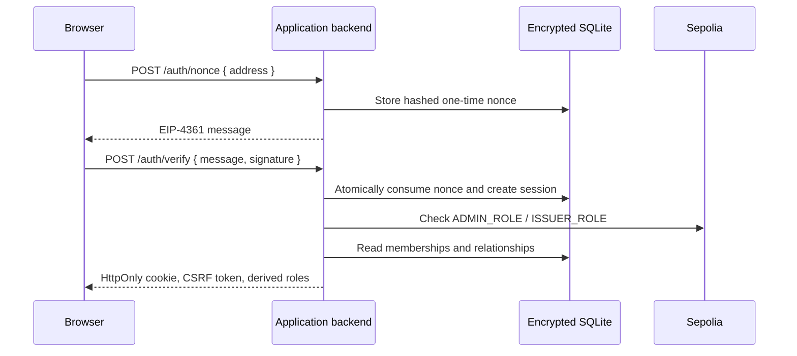

# PramaanChain Backend Architecture

PramaanChain has two Express services with different responsibilities. The
blockchain gateway exposes public chain data. The application backend manages
authenticated, private workflows. They are intentionally separate.

## Service map



| Service | Default base URL | Primary responsibility |
| --- | --- | --- |
| Blockchain gateway | `http://localhost:3000/api` | Contract reads, raw and transformed events, certificate index, and optional protected issuer writes |
| Application backend | `http://localhost:4000/api` | SIWE sessions, authorization, encrypted institutions and relationships, requests, and transaction confirmation |

See [Backend API](BACKEND_API.md) for every implemented GET and POST endpoint.

## Blockchain gateway

The gateway is a stateless HTTP boundary around ethers.js plus an in-memory
event-derived certificate index.

### Startup validation

Before serving useful blockchain data, the service validates:

- Sepolia chain ID `11155111`
- configured contract address and deployed bytecode
- ABI compatibility
- configured issuer address and authorization when write mode is enabled

The Docker application starts this service without an issuer private key or
write API key, so it remains read-only.

### Read paths

Direct reads call the contract for one hash or issuer address. They do not
depend on the historical index:

- health and current block
- certificate verification
- certificate record lookup
- issuer authorization lookup

Indexed reads scan `CertificateIssued` and `CertificateRevoked` logs from the
deployment start block. They provide:

- paginated certificate lists
- active/revoked summary counts
- raw contract events
- transformed audit events

The index sorts certificate lists by newest issuance first. If historical log
queries fail, index-dependent endpoints return `503` until an index exists;
direct verification remains separate.

### Optional write paths

`POST /write/issue` and `POST /write/revoke` are implemented for a separately
configured server-side issuer signer. They require both `x-api-key` and
`Idempotency-Key`, serialize nonce use, wait for confirmed receipts, and
perform post-write state checks.

The browser application does not use these endpoints. It signs contract
transactions with the authenticated administrator or issuer wallet.

## Application backend

The application backend is the private system of record for relationships and
workflow state. It never receives wallet private keys or certificate files.

### SIWE and authorization



Protected requests use the `pc_session` HttpOnly cookie. Every protected
state-changing request also needs the current `x-csrf-token`. Calling
`GET /auth/session` rotates that token.

Authorization is refreshed from the contract and database on each protected
request. Client-supplied roles are ignored.

### Private data model

| Table | Purpose |
| --- | --- |
| `institutions` | Stable public institution ID, display name, and active state |
| `issuer_memberships` | Encrypted issuer wallet linked to one institution |
| `citizens` | Encrypted citizen wallet identity |
| `citizen_relationships` | Private citizen-to-institution links |
| `auth_nonces` | Hashed, short-lived, single-use SIWE challenges |
| `sessions` | Hashed session and CSRF secrets with encrypted wallet address |
| `certificate_requests` | Private request details and issuance workflow state |
| `certificates` | Private citizen assignment and confirmed on-chain metadata |

SQLite uses WAL mode. Sensitive values are protected with AES-256-GCM, and
keyed blind indexes support wallet equality lookup without plaintext indexes.
The database file is created with restricted permissions.

### Institution flow

1. The administrator wallet authorizes the issuer directly on-chain.
2. The application backend confirms the issuer is currently authorized.
3. The administrator registers the institution name, public ID, and issuer
   wallet in private storage.
4. A citizen connects using that public ID.

The public ID is a relationship locator, not a password or secret.

### Issuance and revocation

```mermaid
sequenceDiagram
    actor Issuer
    participant UI as Browser
    participant App as Application backend
    participant Wallet
    participant Contract
    participant DB as Encrypted SQLite

    Issuer->>UI: Select file and request
    UI->>UI: SHA-256 hash exact file bytes
    UI->>App: POST prepare-issuance
    App->>Contract: Confirm hash is NOT_FOUND
    App->>DB: Freeze hash and attempt; set PROCESSING
    App-->>UI: attemptId + documentHash
    UI->>Wallet: Sign issueCertificate(hash)
    Wallet->>Contract: Send transaction
    Contract-->>UI: Confirmed transaction hash
    UI->>App: POST confirm-issuance
    App->>Contract: Validate receipt, sender, event, and ACTIVE state
    App->>DB: Set ISSUED and create private assignment
    App-->>UI: Confirmed certificate
```

Revocation follows the same prepare/confirm pattern. Preparation confirms that
the selected certificate is active and belongs to the authenticated original
issuer. Confirmation validates the transaction receipt and revocation event
before updating private state.

An attempt ID makes retries explicit. A request in `PROCESSING` can be resumed
with the same hash or reconciled using its transaction hash; it must not be
treated as issued before confirmation.

## Configuration

### Shared blockchain identity

- `SEPOLIA_RPC_URL`
- `CHAIN_ID=11155111`
- `CONTRACT_ADDRESS`
- deployment start block for gateway indexing

### Gateway

- RPC request and receipt timeouts
- confirmation count
- event range and chunk limits
- index polling and retry limits
- allowed CORS origins
- exact proxy trust
- optional `ISSUER_PRIVATE_KEY` and `WRITE_API_KEY`

### Application backend

- `APP_ORIGIN`
- `SIWE_DOMAIN`
- `DATABASE_PATH`
- 32-byte base64 `APP_DATA_ENCRYPTION_KEY`
- session and nonce lifetimes
- `COOKIE_SECURE`
- exact proxy trust

Secrets belong in an ignored `.env`, an encrypted keystore, or a deployment
secret manager. Browser `VITE_*` variables are public and must not contain
backend credentials.

## Errors and availability

Both services use JSON errors:

```json
{
  "error": {
    "code": "MACHINE_READABLE_CODE",
    "message": "Safe user-facing description"
  }
}
```

The gateway may additionally include safe `details`, such as a transaction
hash whose confirmation became unknown. Internal errors are sanitized.

Typical status meanings:

| Status | Meaning |
| --- | --- |
| `200`, `201`, `204` | Successful read, creation, or no-content action |
| `400` | Invalid input, hash, query, or workflow transition |
| `401` | Missing/invalid application session or gateway API key |
| `403` | Valid identity without the required role or relationship |
| `404` | Route or requested private/public record not found |
| `409` | Duplicate or conflicting state |
| `429` | Rate limit exceeded |
| `502`, `504` | Blockchain write or confirmation failure |
| `503` | RPC or historical index unavailable |

## Operational boundary

- Use a Sepolia RPC that supports historical `eth_getLogs` from block
  `11318772`.
- Do not put the administrator private key in either backend.
- Keep normal gateway operation read-only unless server-side signing is
  separately required and protected.
- Back up the encrypted database together with its encryption key; losing the
  key makes the private records unreadable.
- SQLite and the in-memory gateway index are suitable for this prototype, not
  a multi-instance production deployment.
