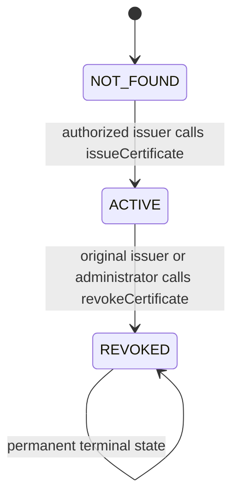
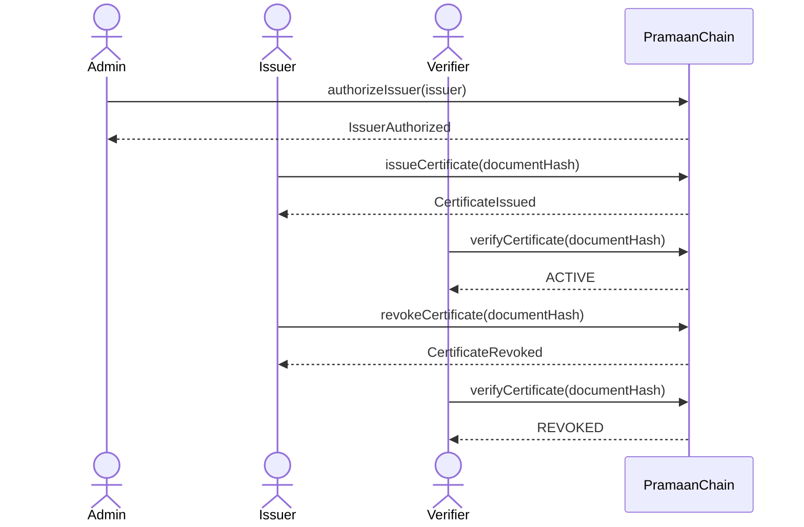

# PramaanChain Smart Contract

`PramaanChain.sol` is an immutable certificate-proof registry deployed on
Ethereum Sepolia. It stores a SHA-256 document hash and minimal public
metadata, never the certificate file or citizen identity.

## Deployment identity

| Item | Value |
| --- | --- |
| Network | Ethereum Sepolia |
| Chain ID | `11155111` |
| Reference address | [`0x0bb21729BBDaBe54A289A1e924941F8F635Cab84`](https://sepolia.etherscan.io/address/0x0bb21729BBDaBe54A289A1e924941F8F635Cab84#code) |
| Deployment block | `11318772` |
| Solidity | `0.8.28` |
| Access control | OpenZeppelin `AccessControl` |
| Source | [`contracts/PramaanChain.sol`](../contracts/PramaanChain.sol) |
| Generated ABI | `artifacts/contracts/PramaanChain.sol/PramaanChain.json` after compilation |

## Roles

| Role | Assigned by | Permissions |
| --- | --- | --- |
| `ADMIN_ROLE` | Constructor grants it to the deployer | Authorize issuers, remove issuers, and revoke any active certificate |
| `ISSUER_ROLE` | Administrator through `authorizeIssuer` | Issue new certificate hashes; original issuer may revoke its own certificate |

The contract sets `ADMIN_ROLE` as the administrator of `ISSUER_ROLE`, but
generic `grantRole`, `revokeRole`, and `renounceRole` are disabled. Issuer
changes must use the domain functions so validation and events cannot be
bypassed.

## Certificate record

```solidity
enum CertificateStatus {
    NOT_FOUND,
    ACTIVE,
    REVOKED
}

struct Certificate {
    address issuer;
    uint64 issuedAt;
    uint64 revokedAt;
    CertificateStatus status;
}
```

Records are stored in a private mapping keyed by `bytes32 documentHash` and
read through `getCertificate`.



There is no edit or restore function. Removing an issuer prevents future
issuance but does not remove or invalidate certificates that issuer created.

## Public functions

| Function | Access | Result |
| --- | --- | --- |
| `authorizeIssuer(address issuer)` | `ADMIN_ROLE` | Grants `ISSUER_ROLE` to a non-zero, not-yet-authorized address |
| `removeIssuer(address issuer)` | `ADMIN_ROLE` | Removes `ISSUER_ROLE` from a currently authorized address |
| `isAuthorizedIssuer(address issuer)` | Public view | Returns current issuer authorization |
| `issueCertificate(bytes32 documentHash)` | `ISSUER_ROLE` | Creates one unique `ACTIVE` certificate record |
| `getCertificate(bytes32 documentHash)` | Public view | Returns issuer, timestamps, and status |
| `verifyCertificate(bytes32 documentHash)` | Public view | Returns `NOT_FOUND`, `ACTIVE`, or `REVOKED` |
| `revokeCertificate(bytes32 documentHash)` | Original issuer or `ADMIN_ROLE` | Permanently sets an active record to `REVOKED` |

`getCertificate` for an unknown hash returns the zero-valued record. Callers
should use its `status` or `verifyCertificate` to distinguish `NOT_FOUND`.

## Lifecycle



All state-changing calls require gas. The administrator and issuer therefore
need Sepolia ETH. View calls require no gas when called through an RPC.

## Events

| Event | Indexed fields | Other fields |
| --- | --- | --- |
| `IssuerAuthorized(address issuer, address administrator)` | `issuer`, `administrator` | — |
| `IssuerRemoved(address issuer, address administrator)` | `issuer`, `administrator` | — |
| `CertificateIssued(bytes32 documentHash, address issuer, uint64 issuedAt)` | `documentHash`, `issuer` | `issuedAt` |
| `CertificateRevoked(bytes32 documentHash, address issuer, address revokedBy, uint64 revokedAt)` | `documentHash`, `issuer`, `revokedBy` | `revokedAt` |

The audit-log UI reads these public Sepolia events. An event shown there is
on-chain evidence and does not originate from the private application
database.

## Custom errors

| Error | Trigger |
| --- | --- |
| `InvalidIssuerAddress()` | Administrator supplies the zero address |
| `IssuerAlreadyAuthorized(address issuer)` | Address already holds the issuer role |
| `IssuerNotAuthorized(address issuer)` | Removal targets an address without the issuer role |
| `InvalidDocumentHash()` | Issuance uses `bytes32(0)` |
| `CertificateAlreadyExists(bytes32 documentHash)` | Hash was previously issued |
| `CertificateNotFound(bytes32 documentHash)` | Revocation targets an unknown hash |
| `CertificateAlreadyRevoked(bytes32 documentHash)` | Revocation is attempted twice |
| `UnauthorizedRevoker(address account, bytes32 documentHash)` | Caller is neither original issuer nor administrator |
| `DirectRoleManagementDisabled()` | Generic AccessControl role mutation is attempted |

OpenZeppelin also emits `AccessControlUnauthorizedAccount` when a caller lacks
the role required by `onlyRole`.

## Document hash

The contract expects a SHA-256 digest formatted as Solidity `bytes32`:

```text
0x + exactly 64 hexadecimal characters
```

The frontend computes SHA-256 from the exact raw file bytes using browser Web
Crypto. The same bytes always produce the same hash; any file change produces
a different hash.

Example using synthetic text:

```bash
printf %s 'synthetic certificate example' | sha256sum
```

Prefix the 64-character digest with `0x` before calling the contract. Do not
hash a filename, path, JSON wrapper, or base64 representation when the
verification flow hashes raw file bytes.

## Security and privacy invariants

- A zero document hash cannot be issued.
- A document hash can be issued only once, even after revocation.
- Only a currently authorized issuer can issue.
- Only the original issuer or an administrator can revoke.
- Revocation is permanent.
- No function can edit an issued record.
- `tx.origin` is not used.
- The contract makes no external calls beyond inherited internal role logic.
- `block.timestamp` records approximate chain time; it is not used for
  time-sensitive authorization.
- No personal information, certificate contents, or revocation explanation is
  stored or emitted.

## Compile and test

```bash
npm ci
npm run compile
npm test
```

Local development commands are documented in the repository
[README](../README.md). Sepolia deployment or any other public-network
transaction requires explicit approval and dedicated test-only wallets.
