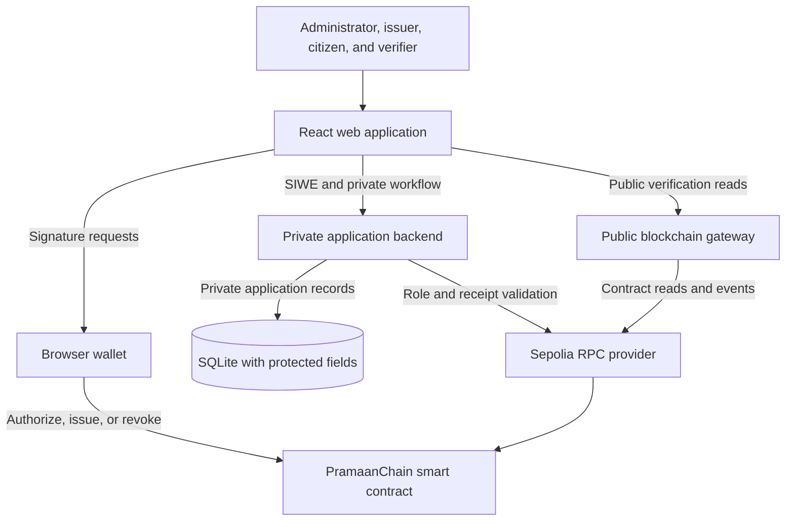
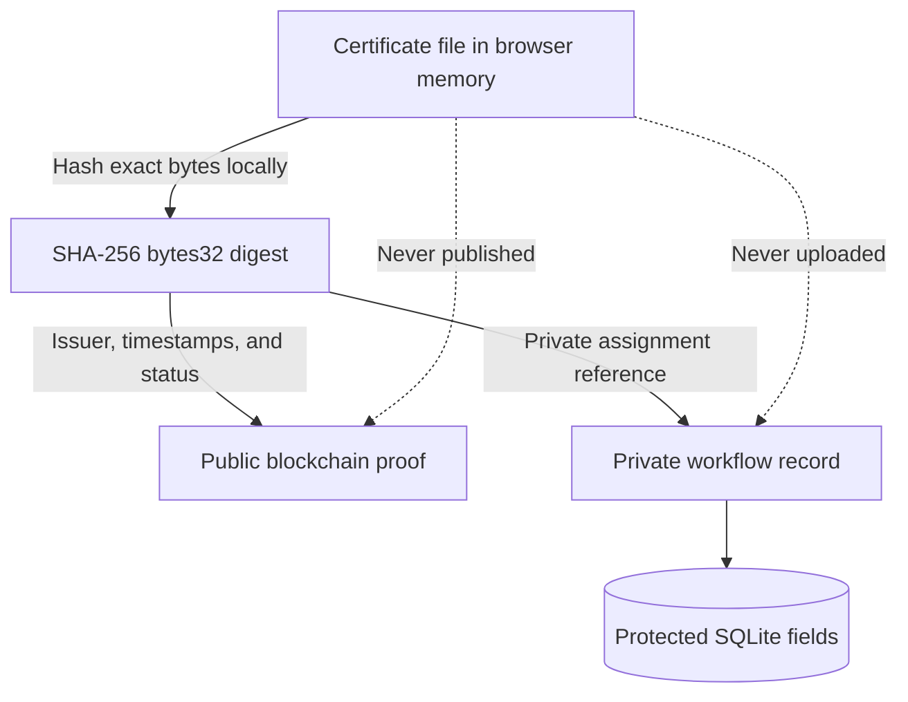
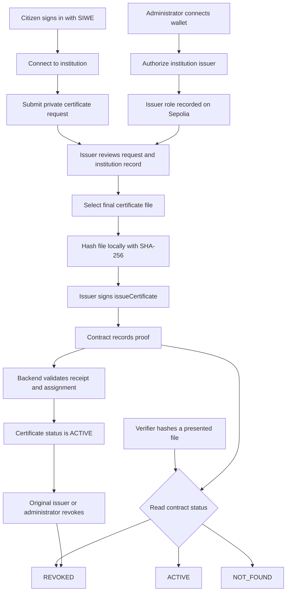
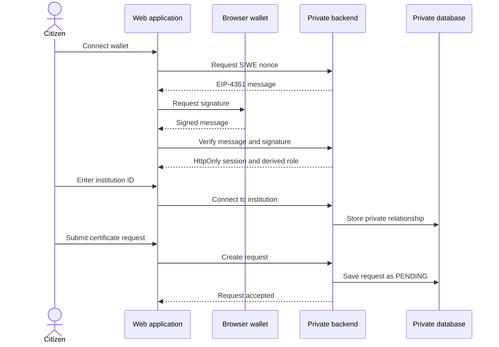
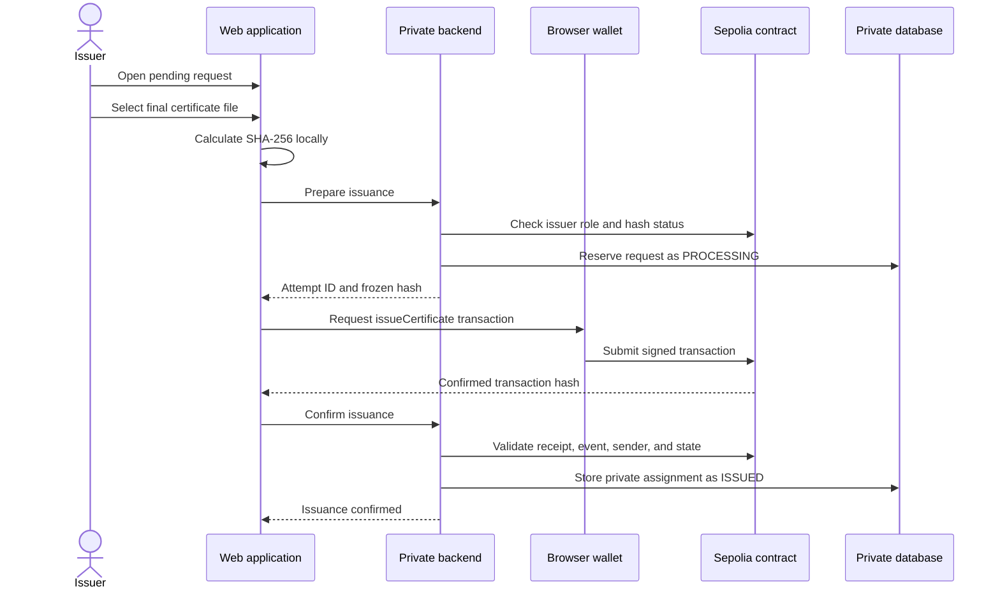
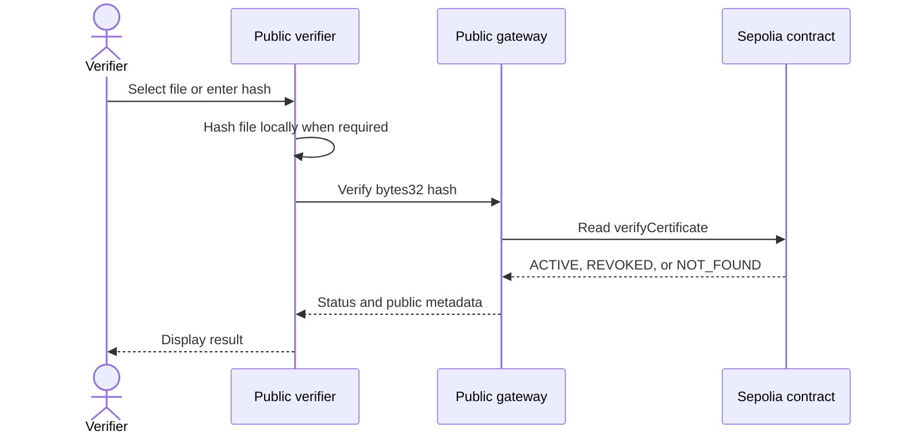
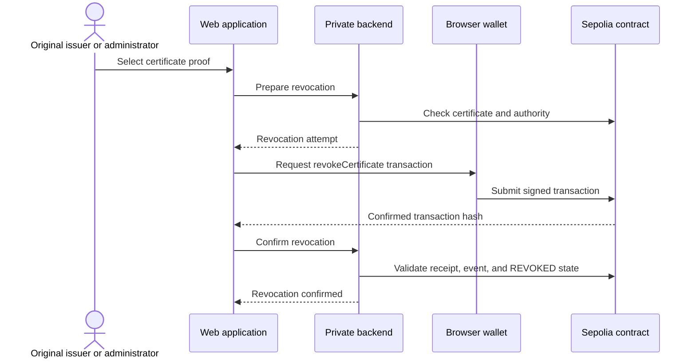
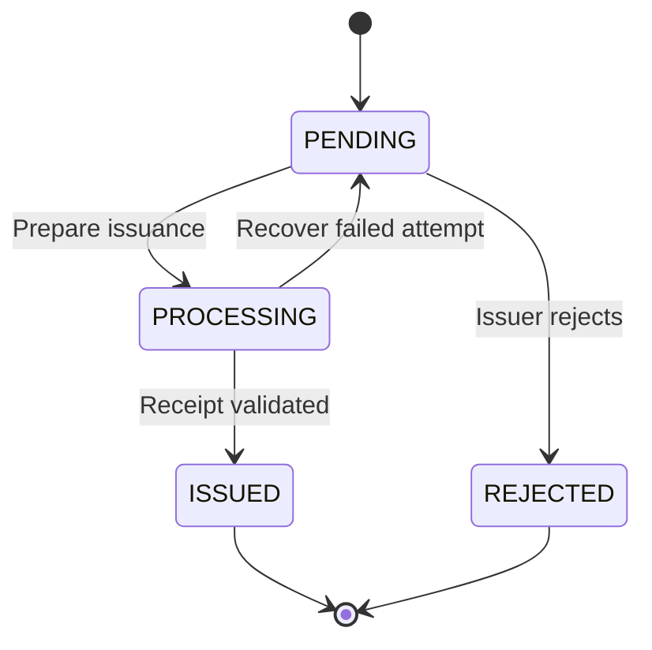
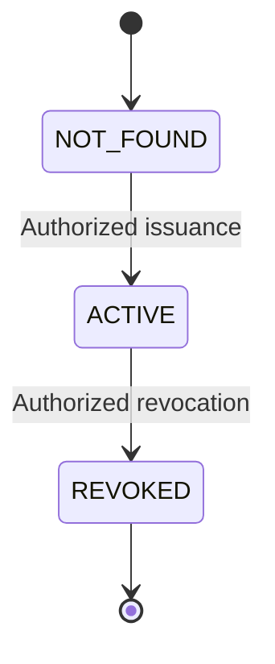
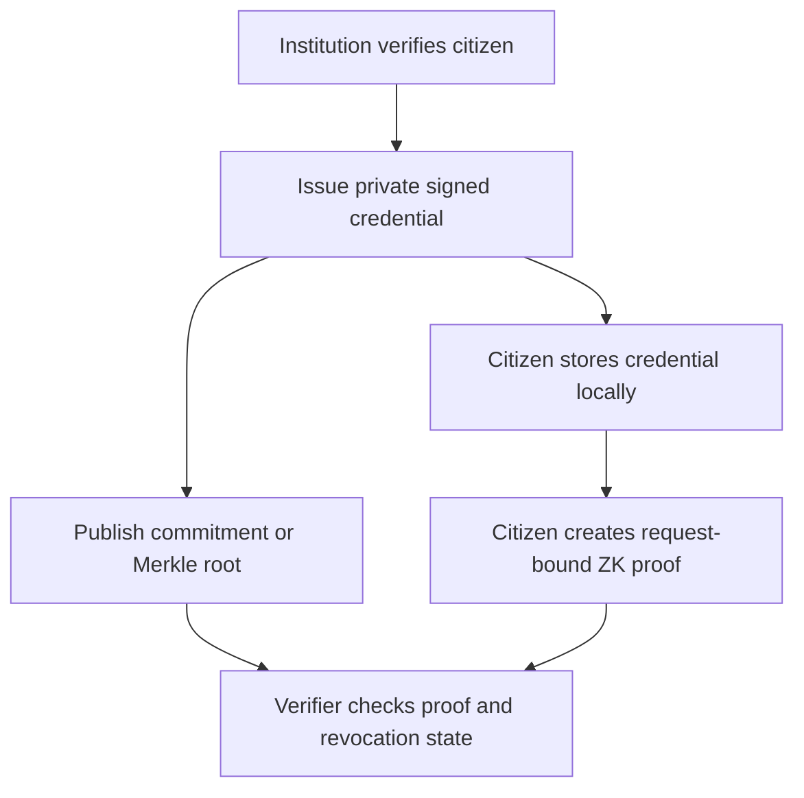

# PramaanChain

## Final Project Proposal and Technical Design

**Project type:** Blockchain-backed certificate issuance and verification

**Network:** Ethereum Sepolia testnet

**Repository:** [prabinpkrl/pramaan-chain-smart-contracts](https://github.com/prabinpkrl/pramaan-chain-smart-contracts)

**Reference contract:** [`0x0bb21729BBDaBe54A289A1e924941F8F635Cab84`](https://sepolia.etherscan.io/address/0x0bb21729BBDaBe54A289A1e924941F8F635Cab84#code)

**Chain ID:** `11155111`

> PramaanChain is a fellowship prototype. It must not be used with real
> certificates, personal information, personal wallets, or mainnet funds.

---

## 1. Executive Summary

PramaanChain is a hybrid, blockchain-backed certificate issuance and
verification system. It allows approved institutions to register a
cryptographic proof of a certificate on Ethereum Sepolia. A verifier can later
check whether the exact certificate is `ACTIVE`, `REVOKED`, or `NOT_FOUND`
without contacting the institution or uploading the certificate to the
PramaanChain server.

The certificate file is hashed locally in the issuer's or verifier's browser.
Only its SHA-256 digest and necessary blockchain metadata are public. The file,
citizen name, marks, government ID, email, address, and other personal
information are never stored on-chain.

PramaanChain combines four parts:

1. A Solidity smart contract that controls issuers and certificate proofs.
2. A public blockchain gateway for read-only verification and event indexing.
3. A private application backend for SIWE authentication, institutions,
   citizen relationships, requests, and transaction confirmation.
4. A web application with administrator, issuer, citizen, and verifier portals.

The blockchain provides a tamper-resistant public proof of issuance and
revocation. The application backend manages the private workflow that should
not be public.

---

## 2. Problem Statement

Traditional certificate verification has several weaknesses:

- Forged certificates and altered documents can be difficult to detect.
- Verification often requires contacting the issuing institution manually.
- Institution databases can become unavailable or be changed without a public
  audit trail.
- Revocation information may not be visible to every verifier.
- Publishing certificate files or personal data on a public blockchain creates
  serious privacy risks.
- A system without issuer authorization could allow unknown parties to register
  false certificate proofs.

Blockchain can improve integrity and public availability, but it cannot by
itself confirm that an issuer entered truthful information. PramaanChain
therefore combines blockchain verification with controlled issuer onboarding
and private institution workflows.

---

## 3. Proposed Solution

PramaanChain gives each component one clear responsibility:

- The institution confirms that a certificate is correct and belongs to the
  intended citizen using its existing records.
- SIWE proves that a user controls the connected Ethereum wallet.
- The private backend stores the citizen-to-institution relationship, service
  request, and certificate assignment.
- SHA-256 proves whether a presented file is byte-for-byte identical to the
  issued file.
- The smart contract proves which authorized wallet issued the hash and
  whether it remains active or has been permanently revoked.

This creates public verification without making the certificate contents or
citizen identity public.

### Core principle

```text
Keep the document private.
Publish only its proof.
Let anyone verify the proof.
```

---

## 4. Project Objectives

### Primary objectives

1. Allow an administrator to authorize and remove institution issuer wallets.
2. Allow only authorized issuers to register unique certificate hashes.
3. Prevent zero hashes, duplicate issuance, editing, and repeated revocation.
4. Allow the original issuer or an administrator to revoke a certificate
   permanently.
5. Allow anyone to verify a certificate without authentication, a wallet, or
   gas.
6. Keep certificate files and personally identifiable information off-chain.
7. Support citizen-to-multiple-institution relationships and private
   certificate requests.
8. Require browser wallets to sign administrator and issuer transactions.
9. Independently validate transaction receipts before updating private
   application records.

### Secondary objectives

- Provide clear role-based dashboards.
- Provide Docker-based local setup and demonstration.
- Produce automated tests for contract, gateway, backend, and frontend logic.
- Document trust boundaries, APIs, contract behavior, and limitations.

---

## 5. Scope

### Implemented

- Solidity certificate registry using OpenZeppelin `AccessControl`
- Administrator and issuer authorization
- Unique SHA-256 certificate-proof issuance
- Public `ACTIVE`, `REVOKED`, and `NOT_FOUND` verification
- Permanent revocation
- Ethereum Sepolia deployment
- Browser-side file hashing
- Browser-wallet transaction signing
- SIWE authentication
- Institution, issuer, citizen, request, and certificate-assignment workflows
- Sensitive-field protection in SQLite using AES-256-GCM and blind indexes
- Public blockchain gateway and event index
- Administrator, issuer, citizen, and verifier web portals
- Docker Compose setup
- Automated contract, backend, and frontend tests

### Deferred

- Ethereum mainnet or production L2 deployment
- Real certificate or personal-data processing
- Production key management and hardware-wallet policy
- Multisignature administrator governance
- Wallet recovery and wallet rotation
- Zero-knowledge citizen-ownership proofs
- Verifiable Credentials
- Merkle-tree batch issuance
- Encrypted document backup or decentralized file storage
- Independent smart-contract security audit
- Production monitoring and incident response

---

## 6. Users and Permissions

| Actor | Main permissions |
|---|---|
| Administrator | Authorize or remove issuer wallets, register institutions, and perform emergency revocation |
| Issuer | Review institution requests, hash certificate files locally, issue proofs, and revoke proofs originally issued by that wallet |
| Citizen | Sign in with a wallet, connect to one or more institutions, request a certificate, and view privately assigned proofs |
| Public verifier | Upload a local file or enter a hash and read its public blockchain status without login |

The backend derives trusted roles. The browser does not get to claim that a
user is an administrator or issuer.

---

## 7. Technology Stack

| Layer | Technology |
|---|---|
| Smart contract | Solidity `0.8.28`, OpenZeppelin Contracts `5.6.1` |
| Contract development | Hardhat `3.10.0`, JavaScript, ethers.js `6.x` |
| Blockchain network | Ethereum Sepolia, local Hardhat network |
| Public gateway | Node.js, Express, ethers.js |
| Private backend | Node.js, Express, SIWE, better-sqlite3 |
| Frontend | React `19`, Vite `8`, Tailwind CSS `4`, Motion `12` |
| Authentication | Sign-In with Ethereum, HttpOnly sessions, CSRF protection |
| Protected storage | SQLite with AES-256-GCM-protected fields and HMAC blind indexes |
| Runtime | Docker Compose, Nginx |

---

## 8. System Architecture



### Component responsibilities

| Component | Responsibility |
|---|---|
| Web application | Local hashing, wallet connection, role-based screens, public verification, and transaction preparation |
| Browser wallet | SIWE signatures and user-approved Sepolia transactions; private keys never enter the application |
| Private application backend | Sessions, institutions, private relationships, requests, receipt validation, and certificate assignment |
| Public blockchain gateway | Read-only contract API, event retrieval, certificate index, summaries, and degraded-index fallback |
| Smart contract | Issuer authorization, immutable issuance records, permanent revocation, and public status |
| SQLite database | Private application relationships and workflow data; it is not the public source of certificate authenticity |

The normal application uses browser wallets for all administrator and issuer
writes. The frontend does not receive an administrator private key, issuer
private key, RPC credential, or database encryption key.

---

## 9. Privacy and Data Architecture



### Public blockchain data

- SHA-256 document hash as Solidity `bytes32`
- Original issuer wallet address
- Issuance timestamp
- Revocation timestamp
- `ACTIVE`, `REVOKED`, or `NOT_FOUND` status
- Transaction and event metadata

### Private application data

- Institution and issuer relationships
- Citizen wallet relationships
- SIWE sessions and authentication records
- Certificate requests
- Private certificate assignments
- Operational identifiers and transaction-confirmation state

### Prohibited on-chain and event data

- Certificate files or contents
- Citizen names
- Government or student identification numbers
- Dates of birth
- Phone numbers or email addresses
- Home addresses
- Marks or grades
- Detailed revocation reasons
- Any other personally identifiable information

A SHA-256 hash is a document fingerprint, not encryption. Anyone who already
possesses the same file can calculate the same hash and discover its public
record.

---

## 10. Overall System Flowchart



---

## 11. Main Functional Flows

### 11.1 Institution and issuer onboarding

1. The administrator connects the approved administrator wallet.
2. The application confirms the administrator role on-chain.
3. The administrator registers the institution in the private application.
4. The administrator calls `authorizeIssuer(issuerAddress)`.
5. The smart contract rejects unauthorized administrators and the zero address.
6. The issuer role is recorded on-chain and an authorization event is emitted.
7. The private backend validates the confirmed transaction before activating
   the institution membership.

### 11.2 Citizen connection and request

1. The citizen connects a wallet and signs an EIP-4361 SIWE message.
2. The backend verifies the signature, nonce, domain, URI, chain, and expiry.
3. The citizen enters the institution's public ID or code.
4. A private citizen-to-institution relationship is created.
5. The citizen chooses the institution and certificate type.
6. The request is stored privately as `PENDING`.
7. Only issuers belonging to that institution can view the request.

The institution must confirm the citizen and document against its own trusted
records. SIWE proves wallet control; it does not prove real-world identity or
certificate ownership.

### 11.3 Certificate issuance

1. The issuer signs in using SIWE.
2. The backend checks both institution membership and current on-chain issuer
   authorization.
3. The issuer opens a pending request and selects the final certificate file.
4. The browser calculates SHA-256 over the exact file bytes.
5. The backend reserves the request as `PROCESSING`.
6. The browser wallet signs `issueCertificate(documentHash)`.
7. The smart contract validates issuer authorization, non-zero hash, and
   uniqueness.
8. The contract stores the issuer and timestamp and emits
   `CertificateIssued`.
9. The backend validates the chain, contract, sender, receipt, event, hash, and
   final state.
10. The private request becomes `ISSUED`, and the certificate is assigned to
    the citizen.

### 11.4 Public verification

1. A verifier opens the public portal without signing in.
2. The verifier selects a certificate file or enters a known `bytes32` hash.
3. If a file is selected, the browser hashes it locally.
4. A read-only contract call checks the hash.
5. The result is displayed as:

| Status | Meaning |
|---|---|
| `ACTIVE` | The hash was issued and has not been revoked |
| `REVOKED` | The hash was issued but later permanently revoked |
| `NOT_FOUND` | The hash does not exist in this deployed registry |

### 11.5 Certificate revocation

1. The original issuer or administrator selects an issued certificate proof.
2. The wallet signs `revokeCertificate(documentHash)`.
3. The contract checks existence, authority, and current status.
4. The contract records the revocation timestamp and emits
   `CertificateRevoked`.
5. The backend independently validates the transaction.
6. All later verification calls return `REVOKED`.

Revocation is permanent. A revoked hash cannot be reactivated or issued again.

---

## 12. Sequence Diagrams

### 12.1 Citizen authentication and certificate request



### 12.2 Certificate issuance



### 12.3 Public certificate verification



### 12.4 Revocation



---

## 13. State Models

The private application request and public blockchain certificate use separate
state machines.

### Application request lifecycle



### Blockchain certificate lifecycle



There is no `REVOKED` to `ACTIVE` transition.

---

## 14. Smart-Contract Design

### Main functions

```solidity
authorizeIssuer(address issuer)
removeIssuer(address issuer)
isAuthorizedIssuer(address issuer)
issueCertificate(bytes32 documentHash)
getCertificate(bytes32 documentHash)
verifyCertificate(bytes32 documentHash)
revokeCertificate(bytes32 documentHash)
```

### Main business rules

1. The deployer initially receives the administrator role.
2. Only an administrator can authorize or remove issuers.
3. The zero address cannot be authorized.
4. Only an authorized issuer can issue a certificate proof.
5. A zero document hash cannot be issued.
6. The same document hash cannot be issued twice.
7. Issued records cannot be edited or deleted.
8. Only the original issuer or an administrator can revoke a proof.
9. A missing proof cannot be revoked.
10. A proof cannot be revoked twice.
11. Revocation is permanent.
12. Removing an issuer prevents future issuance from that wallet.
13. Removing an issuer does not invalidate proofs it previously issued.
14. Anyone can use public read-only verification.

The contract avoids unnecessary external calls and does not use `tx.origin`.

---

## 15. Security and Reliability Design

| Control | Purpose |
|---|---|
| OpenZeppelin role-based access control | Restricts issuer management and issuance |
| Browser-wallet signing | Keeps private keys outside the application |
| SIWE authentication | Proves control of the connected wallet |
| Server-derived roles | Prevents the browser from self-assigning privileges |
| Local SHA-256 hashing | Prevents certificate-file upload |
| Receipt and event validation | Prevents unconfirmed or unrelated transactions from being recorded |
| Idempotent confirmation | Avoids duplicate application updates after retries |
| CSRF protection and HttpOnly sessions | Protects authenticated application mutations |
| AES-256-GCM-protected fields | Reduces exposure of sensitive private workflow data |
| HMAC blind indexes | Supports lookups without searchable plaintext wallet values |
| Rate limiting | Reduces automated API abuse |
| Chain and contract checks | Prevents wrong-network and wrong-contract confirmation |
| Docker deployment profile | Keeps deployment actions separate from normal application startup |

For production, these controls would need to be supported by HTTPS, managed
secrets, hardened infrastructure, monitoring, backups, professional security
review, and organization-controlled wallets.

---

## 16. Testing and Current Evidence

The finalized prototype was reviewed with the following automated results:

| Component | Result |
|---|---|
| Smart contract and deployment tests | 65 passed |
| Public gateway tests | 28 passed |
| Private application backend tests | 13 passed |
| Frontend tests | 28 passed |
| Solidity compilation | Passed |
| Frontend lint | Passed |
| Frontend production build | Passed |
| Production dependency audit | 0 known vulnerabilities at review time |

The reference contract is deployed and source-verified on Ethereum Sepolia.
Testing uses synthetic hashes, development addresses, and test ETH only.

---

## 17. Benefits

- A verifier does not need to contact the issuing institution.
- Public verification does not require a wallet, login, or gas.
- Certificate files and citizen PII are not placed on-chain.
- Issuer authorization is transparent and enforceable.
- Certificate proof status is publicly auditable.
- Revocation is visible and irreversible.
- Citizens can interact with multiple institutions from one portal.
- Browser-wallet signing keeps write authority with the user.
- The private workflow can evolve without changing public certificate history.

---

## 18. Limitations

1. **Citizen ownership is not proven on-chain.**

   The institution checks its own records, while the private backend assigns
   the certificate proof to the citizen wallet.

2. **SIWE proves wallet control, not real-world identity.**

   Institution onboarding and identity checking remain trusted off-platform
   processes.

3. **The system contains centralized components.**

   Dashboard workflows depend on the private backend, database, administrator,
   and RPC provider. Direct blockchain verification can remain available
   independently.

4. **Blockchain cannot determine whether issuer data is truthful.**

   It proves which authorized wallet recorded a hash, not whether the
   certificate contents are factually correct.

5. **SHA-256 is not encryption.**

   A person with the same PDF can calculate its hash and correlate the public
   record.

6. **Verification depends on exact file bytes.**

   Re-exporting a PDF or changing harmless metadata produces a different hash.

7. **Each proof requires a transaction.**

   The current contract does not support Merkle-tree batch issuance.

8. **The blockchain does not store or recover documents.**

   A lost certificate file cannot be restored from PramaanChain.

9. **Wallet loss or compromise is not fully handled.**

   Production use requires wallet rotation, recovery, multisig governance, and
   incident procedures.

10. **Sepolia is only a test network.**

    The current deployment is demonstration evidence, not production
    infrastructure.

---

## 19. Future Improvements

### High priority

- Add stronger institution onboarding and audit procedures.
- Introduce issuer-wallet rotation and multisignature administration.
- Deploy to a suitable EVM Layer 2 after professional security review.
- Add production monitoring, encrypted backups, and managed secret storage.
- Define a safe document recovery option controlled by the citizen.

### Privacy and ownership upgrade

A future version can use Verifiable Credentials and zero-knowledge proofs:



The proof could show:

> I possess a valid credential from this institution, it is bound to my wallet,
> it has not been revoked, and it is being used for this request.

The proof would not reveal the citizen's name, student ID, credential contents,
or private institution record. This could remove the sensitive
citizen-to-certificate ownership mapping from the PramaanChain database, but
the institution would still keep its original records.

### Scalability upgrade

- Combine many salted document commitments in a Merkle tree.
- Store one Merkle root per batch on-chain.
- Give each certificate holder a separate Merkle proof.
- Design independent per-certificate revocation.

---

## 20. Expected Outcome

PramaanChain demonstrates that blockchain can provide an independently
verifiable certificate-proof registry without publishing certificate files or
citizen personal information. The completed prototype shows the full journey
from issuer authorization and citizen request through browser-side hashing,
wallet-signed issuance, public verification, and permanent revocation.

The project does not claim to remove all institutional trust. Instead, it makes
issuer authority and certificate status publicly auditable while minimizing
the amount of private information exposed to the blockchain.

---

## 21. Conclusion

PramaanChain is a working privacy-conscious certificate verification prototype
built on Ethereum Sepolia. Its strongest design choice is the separation
between public authenticity proof and private application ownership:

```text
Institution records establish real-world correctness.
SIWE establishes wallet control.
The private backend manages relationships and requests.
SHA-256 identifies the exact certificate file.
The smart contract proves issuer authority and certificate status.
```

This separation produces a practical fellowship prototype while leaving a
clear path toward stronger privacy, ownership proofs, scalability, and
production security.

---

## 22. Project Links

- [GitHub repository](https://github.com/prabinpkrl/pramaan-chain-smart-contracts)
- [System architecture](https://github.com/prabinpkrl/pramaan-chain-smart-contracts/blob/master/docs/SYSTEM_ARCHITECTURE.md)
- [Smart-contract documentation](https://github.com/prabinpkrl/pramaan-chain-smart-contracts/blob/master/docs/CONTRACT.md)
- [Backend architecture](https://github.com/prabinpkrl/pramaan-chain-smart-contracts/blob/master/docs/BACKEND_ARCHITECTURE.md)
- [Frontend architecture](https://github.com/prabinpkrl/pramaan-chain-smart-contracts/blob/master/docs/FRONTEND_ARCHITECTURE.md)
- [Sepolia contract on Etherscan](https://sepolia.etherscan.io/address/0x0bb21729BBDaBe54A289A1e924941F8F635Cab84#code)

---

## 23. Team Contribution

Complete this table with the final team details before submission.

| Team member | Main contribution |
|---|---|
| Prabin | Blockchain & Distributed Ledger Layer |
| Arjun | Cryptography & Backend Core Services |
| Mahesh | Issuer Portal & Verifier Application |
| Sayujya | Citizen Wallet, Privacy & Platform |
