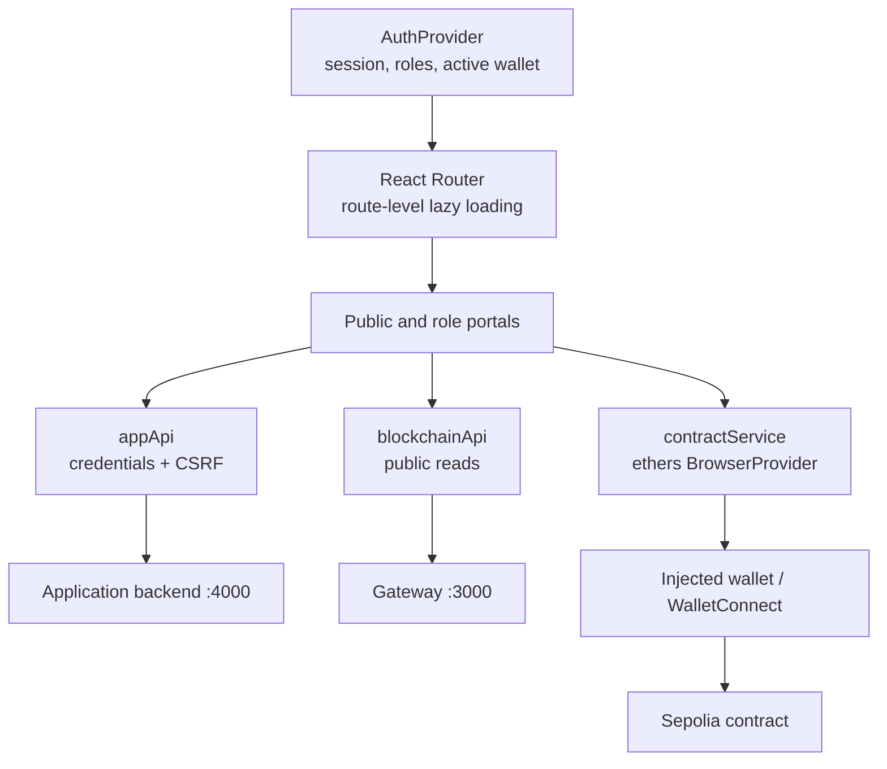
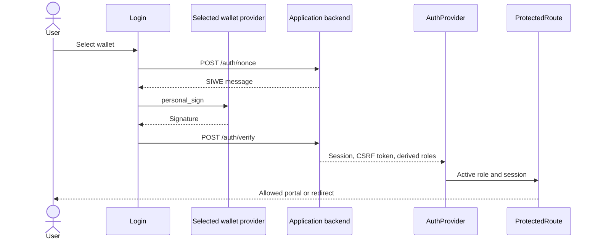
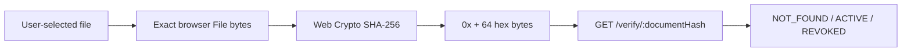
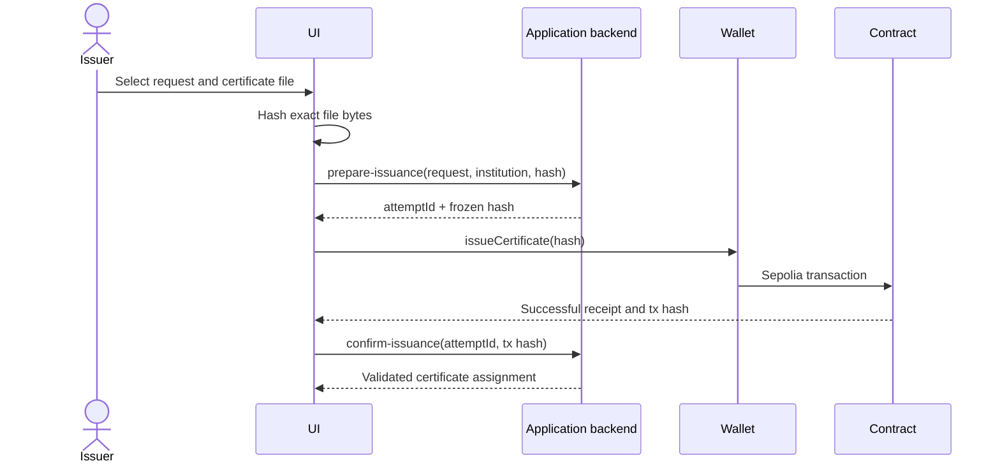

# PramaanChain Frontend Architecture

The `__frontend/` package is one React and Vite application containing the
public verifier plus administrator, issuer, citizen, and unlinked-wallet
views. It uses the private application backend for authenticated workflows,
the gateway for public chain reads, and the selected wallet provider for
contract writes.

## Runtime structure



## Routes

### Public routes

| Path | View |
| --- | --- |
| `/` | Landing page |
| `/login` | Wallet discovery and SIWE sign-in |
| `/verify` | Public file/hash verifier |
| `/verify/:documentHash` | Public verifier preloaded with a hash |

### Administrator routes

| Path | View |
| --- | --- |
| `/admin/dashboard` | Administrator overview |
| `/admin/issuers` | Authorize and register institution issuers |
| `/admin/monitor` | Blockchain and index monitoring |
| `/admin/audit-logs` | Transformed Sepolia contract events |

All administrator routes require the backend-derived `ADMIN` role.

### Issuer routes

| Path | View |
| --- | --- |
| `/issuer/dashboard` | Issuer overview and institution selection |
| `/issuer/issue` | Review and issue pending requests |
| `/issuer/documents` | Issued certificate registry |
| `/issuer/revoked` | Revoked certificate list |
| `/issuer/profile` | Wallet and institution profile |

All issuer routes require the backend-derived `ISSUER` role.

### Citizen routes

| Path | View |
| --- | --- |
| `/citizen/dashboard` | Citizen overview |
| `/citizen/my-documents` | Privately assigned certificates |
| `/citizen/history` | Local/public verification history view |
| `/citizen/connect` | Connect to an institution by public ID |
| `/citizen/requests` | Create and review certificate requests |
| `/citizen/verify` | Redirects to `/verify` |
| `/citizen/claim` | Redirects to `/citizen/connect` |

Citizen data routes require `CITIZEN`. The connect route accepts `UNLINKED` or
`CITIZEN`. Unknown routes redirect to `/`.

## Data clients

The frontend maintains two Axios clients:

| Client | Default base URL | Behavior |
| --- | --- | --- |
| `appApi` | `http://localhost:4000/api` | Sends cookies, applies a 20-second timeout, and attaches the current CSRF token to state-changing methods |
| `blockchainApi` | `http://localhost:3000/api` | Public read-only requests with a 20-second timeout |

The public client supplies verification, certificate, summary, issuer, health,
and event data. The private client supplies authentication, institutions,
relationships, requests, and receipt-confirmed certificate assignments.

The optional gateway `/write/*` endpoints are never called by the frontend.

## Authentication and role routing



`AuthProvider`:

- restores the current session on application load
- chooses a default role using `ADMIN`, `ISSUER`, `CITIZEN`, `UNLINKED`
  priority
- allows a multi-role wallet to switch among its returned roles
- clears the session when the selected wallet account or chain changes
- retains the selected provider for authorized contract actions

The session token is an HttpOnly cookie and is not read by JavaScript. The
CSRF token is held in application memory and added by the private API client.

## Wallet providers

The login view discovers injected extensions through EIP-6963 and retains
legacy `window.ethereum` support. WalletConnect QR/mobile login is available
when a public `VITE_WALLETCONNECT_PROJECT_ID` is configured.

The provider selected during sign-in is also used for contract writes. Before
submitting a transaction, the frontend:

1. switches the provider to configured chain ID `11155111` when necessary
2. gets the current signer
3. verifies that signer address equals the authenticated session address
4. sends the exact contract method
5. waits for a successful receipt

This prevents a stale or different wallet account from acting under another
authenticated session.

## Document hashing and public verification



The file never leaves the browser. The frontend accepts either a selected file
or an existing `bytes32` hash, validates the hash shape, and sends only that
hash to the gateway. Verification needs no wallet, session, transaction, or
gas.

QR codes contain only a public `/verify/<documentHash>` URL.

## Issuance flow



Revocation uses the same division of responsibility:

- the private backend prepares and returns the exact document hash
- the issuer wallet signs `revokeCertificate(documentHash)`
- the private backend independently validates the receipt and updates the
  assignment

If submission or confirmation is interrupted, the frontend must preserve the
attempt and transaction hash for resume or reconciliation rather than creating
a different logical operation.

## Administrator issuer flow

The administrator wallet signs `authorizeIssuer(issuerAddress)` directly.
After the receipt succeeds, the frontend verifies issuer authorization through
the gateway and calls the private backend to register the institution public
ID, display name, and issuer membership.

The administrator private key never enters either backend. Issuer removal is
supported by the contract but is not exposed in the current frontend.

## State and presentation

- React Router provides route-level lazy loading.
- `Suspense` displays a shared route loader.
- API errors are normalized to a user-facing message from the backend error
  envelope.
- Pages should distinguish loading, empty, degraded, and failed states.
- Event-based audit data is public Sepolia history, while citizen assignments
  and request state come from the private backend.
- Newest indexed certificates and audit events are displayed first by the
  relevant data service/UI sorting behavior.

## Runtime configuration

The frontend reads build-time `VITE_*` variables or
`window.__PRAMAAN_CONFIG__` runtime values:

| Setting | Purpose |
| --- | --- |
| `appApiUrl` / `VITE_APP_API_URL` | Private backend base URL |
| `blockchainApiUrl` / `VITE_BLOCKCHAIN_API_URL` | Gateway base URL |
| `chainId` / `VITE_CHAIN_ID` | Required wallet network |
| `contractAddress` / `VITE_CONTRACT_ADDRESS` | Contract used for writes |
| `etherscanBaseUrl` / `VITE_ETHERSCAN_BASE_URL` | Public transaction links |
| `publicAppUrl` / `VITE_PUBLIC_APP_URL` | Shareable verification URLs |
| `walletConnectProjectId` / `VITE_WALLETCONNECT_PROJECT_ID` | Optional public WalletConnect identifier |

All browser configuration is public. Never place private keys, seed phrases,
credentialed RPC URLs, application encryption keys, session secrets, or API
keys in `VITE_*` values.

## Build and checks

From `__frontend/`:

```bash
npm ci
npm run lint
npm test
npm run build
npm run dev
```

The standard E2E suite mocks wallet and HTTP boundaries and cannot broadcast a
transaction. The live E2E command is read-only and checks only health and
public verification.

For complete endpoint contracts, see [Backend API](BACKEND_API.md).
