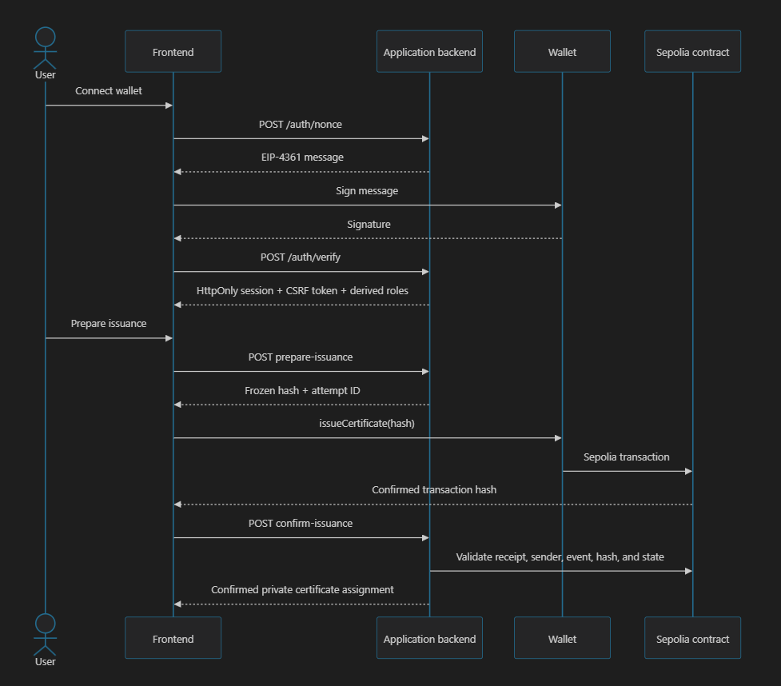

# PramaanChain

---

## Project Detail / Introduction

PramaanChain is an Ethereum-based decentralized certificate issuance and verification system. It provides an immutable, tamper-proof registry where authorized institutions (universities, government agencies, certification bodies) anchor cryptographic proofs (SHA-256 hashes) of their issued certificates on the Ethereum blockchain.

Anyone can independently verify whether a given certificate is **active**, **revoked**, or **never existed** -- without trusting any single central authority.

### Core Principle

Actual certificate files, citizen names, marks, addresses, and all personally identifiable information (PII) **never** touch the blockchain. Only a SHA-256 hash digest and necessary metadata (issuer address, timestamps, status) are stored on-chain. The hash serves as a stable fingerprint for comparison, not as a substitute for the document itself.

### Tech Stack

| Layer              | Technology                                      |
| ------------------ | ----------------------------------------------- |
| Smart Contract     | Solidity 0.8.28, OpenZeppelin Contracts 5.6.1   |
| Development        | Hardhat 3.10.0, ethers.js 6.x                   |
| Public Backend     | Node.js 22.13+, Express 4.x, ethers.js 6.x     |
| Application Backend| Node.js 22.13+, Express 4.x, better-sqlite3, SIWE 3.0 |
| Frontend           | React 19, Vite 8, Tailwind CSS 4, Motion 12    |
| Blockchain Network | Ethereum Sepolia (testnet) / Local Hardhat      |
| Database           | Encrypted SQLite (private citizen/institution records) |

---

## Problem Statement

Credential and certificate fraud is a growing global problem. Fake diplomas, forged transcripts, and unverifiable credentials undermine trust in education and professional certifications. Existing verification systems suffer from several critical flaws:

- **Credential Fraud**: Forged diplomas, fake certificates, and fabricated transcripts are easy to produce and hard to detect, costing institutions and employers billions annually.
- **Centralized Trust Dependency**: Traditional verification relies on a single institution's database -- a single point of failure that can be tampered with, corrupted, or go offline.
- **No Universal Verification**: There is no universal, instant way for anyone to check if a certificate is genuine or has been revoked. Verification typically requires contacting the issuing institution directly.
- **Personal Data Exposure**: Existing on-chain solutions risk exposing sensitive personal data on the public blockchain, creating privacy violations.
- **Revocation Invisibility**: Once a certificate is revoked (due to misconduct, fraud, or error), there is no reliable, publicly auditable mechanism to communicate this to verifiers.
- **Uncontrolled Issuer Access**: Without proper access control, unauthorized entities could issue fraudulent certificates through the system.

---

## Solution

PramaanChain addresses these problems through a **decentralized, privacy-preserving certificate verification protocol** built on Ethereum smart contracts. By anchoring cryptographic proofs on-chain while keeping all personal data off-chain in encrypted private databases, PramaanChain achieves both transparency and privacy.

### System Architecture

### Four Security Components

1. **Smart Contract** (`PramaanChain.sol`): The on-chain truth source for certificate proofs. Stores only hashes, issuer addresses, timestamps, and status.
2. **Blockchain Gateway** (`backend/`): Public, read-heavy blockchain interface with optional server-side issuer writes. Rate-limited and idempotent.
3. **Application Backend** (`app-backend/`): Private service for SIWE authentication, citizen-institution relationships, and certificate request workflow.
4. **Frontend** (`__frontend/`): Browser-based UIs for public verification, issuer management, citizen requests, and administrator controls. Never holds private keys.

---

## How It Solves the Problem

PramaanChain eliminates single points of failure by distributing trust across the Ethereum network. No single institution, database, or administrator can tamper with, delete, or alter certificate records once issued. The protocol enforces a strict lifecycle for every credential, ensuring integrity from issuance through verification.

### Issuance Flow

1. Citizen connects wallet to the citizen portal, signs in with SIWE, and links to an institution.
2. Citizen submits a certificate request (stored in encrypted database).
3. Institution issuer logs into the issuer portal (SIWE + browser wallet).
4. Issuer selects a pending request and the certificate file.
5. **Browser hashes the exact file bytes with SHA-256** -- only the digest leaves the browser.
6. Issuer's browser wallet signs `issueCertificate(documentHash)` on Sepolia.
7. Transaction is confirmed; backend validates receipt and event; certificate is linked to the citizen in the private database.

### Verification Flow

1. Anyone opens the public verifier (no login required).
2. Presents a certificate file or known SHA-256 hash.
3. Browser hashes the file or validates the direct hash input.
4. A provider-only call (no wallet needed) to `verifyCertificate()` returns:
   - **NOT_FOUND** -- certificate was never registered
   - **ACTIVE** -- certificate is valid
   - **REVOKED** -- certificate has been permanently revoked

### Revocation Flow

1. Original issuer or administrator calls `revokeCertificate()` on-chain.
2. Status permanently changes to REVOKED with a timestamp.
3. The hash can never be reissued -- revocation is irreversible.

### Key Design Decisions

| Design Choice | How It Solves the Problem |
|---|---|
| SHA-256 hashing (no PII on-chain) | Prevents personal data exposure while enabling proof-of-existence |
| Strict state machine (NOT_FOUND -> ACTIVE -> REVOKED) | Eliminates ambiguity; no editing, deletion, or reissuance possible |
| Role-based access control (Admin + Issuer) | Prevents unauthorized certificate issuance |
| Public verification without wallet/gas | Anyone can verify without barriers |
| Immutable blockchain registry | Eliminates single point of failure and tampering |
| Idempotent writes with confirmation | Prevents duplicate transactions and ensures consistency |
| Network safety guards | Prevents accidental deployment to mainnet or wrong networks |

---

## Features

### Smart Contract Features

- **Role-Based Access Control**: `ADMIN_ROLE` (deployer) authorizes/removes issuers; `ISSUER_ROLE` can issue and revoke certificates.
- **Certificate Issuance**: Authorized issuers anchor a unique `bytes32` SHA-256 document hash -- permanent, globally unique, immutable.
- **Certificate Verification**: Anyone can call `verifyCertificate()` or `getCertificate()` -- no wallet, no gas, no authentication required.
- **Permanent Revocation**: Original issuer or administrator can irreversibly revoke a certificate with a public timestamp.
- **Strict State Machine**: `NOT_FOUND -> ACTIVE -> REVOKED`. No editing, deletion, reactivation, or reissuance is possible.
- **Disabled Direct Role Management**: `grantRole()`, `revokeRole()`, and `renounceRole()` are overridden to revert, forcing all role changes through domain functions.
- **Minimal Data Surface**: Only `issuer`, `issuedAt`, `revokedAt`, and `status` are stored. No personal data fields exist in the ABI or storage.
- **No External Calls**: Zero external calls, eliminating reentrancy and callback attack surfaces.

### Backend Gateway Features

- **Public REST API** for blockchain reads and optional server-side writes.
- **Event Indexing**: Continuously synchronized in-memory certificate index with reorganization detection and exponential-backoff retry.
- **Idempotency**: Every write requires an `Idempotency-Key` header to prevent duplicate blockchain transactions.
- **Rate Limiting**: 60 reads/min and 10 writes/min per IP.
- **Transaction Safety**: Never marks a write successful from just a transaction hash; waits for confirmed receipt + post-verification read.
- **Startup Checks**: Validates chain ID, contract address, deployed bytecode, and issuer authorization before serving.

### Application Backend Features

- **SIWE (Sign In with Ethereum)** authentication.
- **Encrypted SQLite** database for citizen-institution relationships and certificate assignments.
- **Institution-scoped access control**: An issuer sees only its institution's requests and certificates.
- **Certificate lifecycle management**: Handles request creation, issuance workflow (PENDING -> PROCESSING -> ISSUED), and receipt confirmation.
- **Blockchain confirmation**: Independently validates chain, contract, sender, receipt, event, hash, and final state after each write.

### Frontend Features

- **Four distinct portals**:
  - **Public Verifier**: Hash a file or enter a hash to check certificate status -- no login needed.
  - **Issuer Portal**: Institution employees issue and revoke certificates using browser wallet signing.
  - **Citizen Portal**: Citizens connect wallet, link to an institution, and submit certificate requests.
  - **Administrator Portal**: Manages institutions and issuer authorizations.

