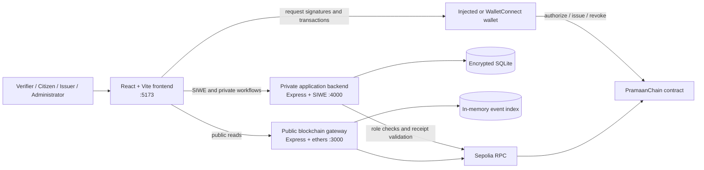
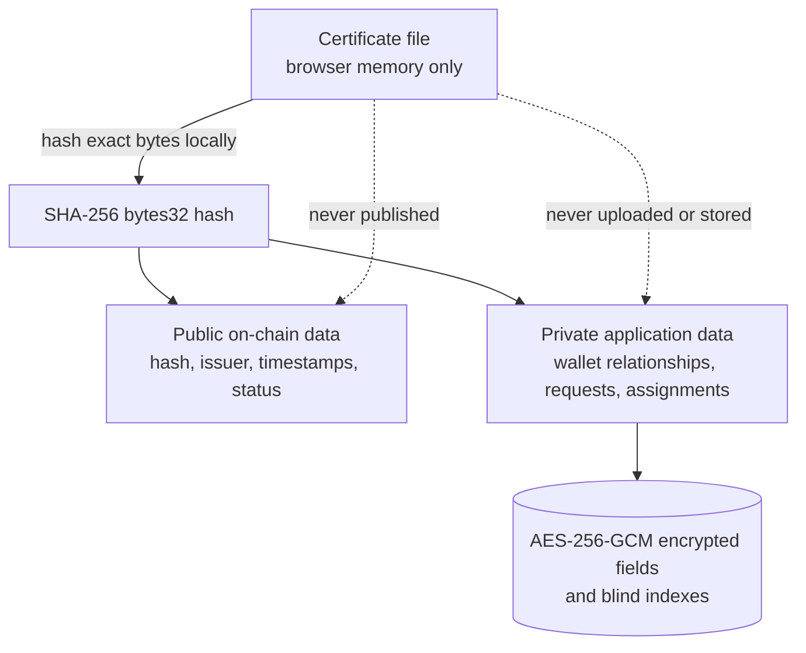
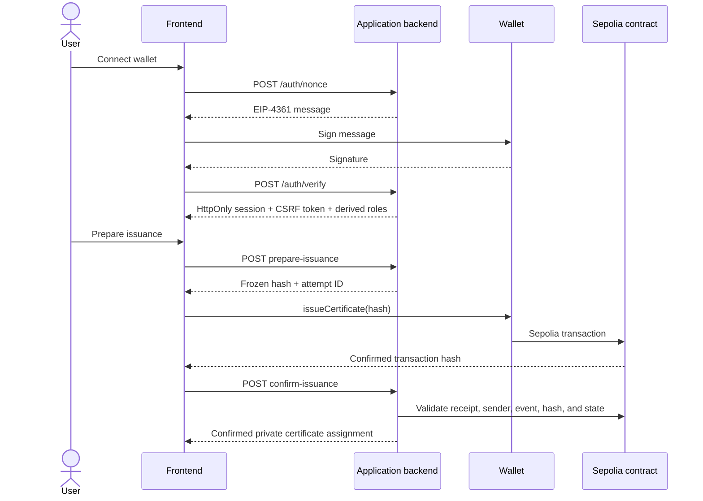

# PramaanChain System Architecture

This document is the source of truth for the current PramaanChain prototype.
It describes the components that run the project, their trust boundaries, and
the data allowed to cross those boundaries.

PramaanChain anchors certificate proofs on Ethereum Sepolia without storing
the certificate file or citizen identity on-chain. It is a fellowship
prototype, not production infrastructure.

## Current deployment

| Item | Value |
| --- | --- |
| Network | Ethereum Sepolia |
| Chain ID | `11155111` |
| Reference contract | `0x0bb21729BBDaBe54A289A1e924941F8F635Cab84` |
| Deployment start block | `11318772` |
| Contract language | Solidity `0.8.28` |
| Access control | OpenZeppelin `AccessControl` |

## Components

| Component | Directory | Responsibility |
| --- | --- | --- |
| Smart contract | `contracts/` | Administrator and issuer roles, immutable issuance records, permanent revocation, and public verification |
| Blockchain gateway | `backend/` | Public contract reads, event reads, certificate indexing, and optional server-side issuer writes |
| Application backend | `app-backend/` | SIWE sessions, server-derived roles, institutions, citizen relationships, requests, and receipt confirmation |
| Web application | `__frontend/` | Public verification and administrator, issuer, and citizen interfaces |
| Docker runtime | `compose.yaml` | Starts the three application services and isolates contract deployment behind the `deploy` profile |

The normal Docker application runs the gateway in read-only mode. Browser
wallets sign administrator and issuer transactions directly. The optional
gateway write endpoints remain implemented but are not used by the frontend.

## Actors and permissions

| Actor | Permitted actions |
| --- | --- |
| Administrator | Authorize or remove issuers, register an authorized issuer as an institution, and perform emergency contract revocation |
| Issuer | Review connected-citizen requests, issue certificate hashes, and revoke certificates originally issued by that wallet |
| Citizen | Connect to an institution, request certificate issuance, and view privately assigned certificate records |
| Verifier | Hash a local file or submit an existing `bytes32` hash and read its public status without authentication or gas |

Roles are derived by the application backend on every protected request:

- `ADMIN` comes from the contract administrator role.
- `ISSUER` requires both a private institution membership and current on-chain
  issuer authorization.
- `CITIZEN` requires a private citizen-to-institution relationship.
- `UNLINKED` is assigned when no protected relationship exists.

The browser never chooses or asserts a trusted role.
Issuer and citizen roles are mutually exclusive. Registering a wallet as an
issuer deactivates its citizen relationships, and an authorized issuer wallet
cannot create a new citizen relationship.

## Data boundaries

### Public on-chain data

Only these certificate fields are public:

- SHA-256 document hash as Solidity `bytes32`
- original issuer address
- issuance timestamp
- revocation timestamp
- `ACTIVE`, `REVOKED`, or `NOT_FOUND` status
- transaction and event metadata

### Private application data

The encrypted SQLite database stores institution records, issuer memberships,
citizen relationships, SIWE nonces, sessions, requests, and certificate
assignments. Sensitive strings and wallet addresses are encrypted; blind
indexes support equality lookup.

### Prohibited data

Certificate files, names, government identifiers, dates of birth, contact
details, home addresses, marks, certificate contents, and detailed revocation
reasons must never be stored on-chain or emitted in events. Real certificate
files and personal information must not be used in this prototype.

## Authentication and transaction flow

Wallet connection is not authentication. SIWE proves wallet control without
sending a transaction. Contract writes require Sepolia ETH for gas; public
reads and verification do not.

## Certificate lifecycle

1. A citizen connects to an institution using its public institution ID.
2. The citizen creates a private certificate request.
3. The issuer hashes the exact certificate file in the browser.
4. The private backend reserves the request as `PROCESSING` with an attempt ID.
5. The issuer wallet signs `issueCertificate(documentHash)`.
6. The backend independently validates the confirmed receipt and stores the
   private assignment as `ISSUED`.
7. Anyone can verify the hash through a read-only call.
8. Revocation uses the same prepare, wallet transaction, and confirmation
   pattern and is permanent.

Request states are `PENDING`, `PROCESSING`, `ISSUED`, and `REJECTED`. Contract
states are `NOT_FOUND`, `ACTIVE`, and `REVOKED`; these are separate state
machines.

## Availability and failure behavior

- Direct verification remains available even when the gateway's historical
  event index is degraded.
- Certificate lists, summaries, and audit events depend on the configured RPC
  supporting historical `eth_getLogs` from block `11318772`.
- The application backend fails protected operations when current on-chain
  role or receipt validation cannot be completed.
- A `PROCESSING` request is a recoverable reservation, not proof that a
  transaction succeeded. Confirmation requires a valid mined receipt.
- The normal application does not receive administrator or issuer private
  keys.

## Security assumptions

- Use dedicated test-only Sepolia wallets with only the ETH required for the
  demonstration.
- Keep private keys, seed phrases, RPC credentials, API keys, encryption keys,
  cookies, and keystores outside version control.
- Keep `TRUST_PROXY=false` unless an exact trusted proxy hop is configured.
- Use HTTPS and secure cookies for any non-local deployment.
- Revalidate the chain ID, contract address, bytecode, roles, and transaction
  receipts rather than trusting browser input.

## Scope

Implemented scope includes the Sepolia contract, public read gateway, private
SIWE/SQLite backend, browser-wallet frontend, and Docker Compose workflow.

Deferred work includes mainnet, production infrastructure, real certificate
storage, wallet recovery, production key management, multisignature
administrator governance, batch issuance, zero-knowledge proofs, and
multi-process signing.

## Detailed documentation

- [Docker demo](DOCKER_DEMO.md)
- [Backend architecture](BACKEND_ARCHITECTURE.md)
- [Backend API](BACKEND_API.md)
- [Frontend architecture](FRONTEND_ARCHITECTURE.md)
- [Smart contract](CONTRACT.md)
