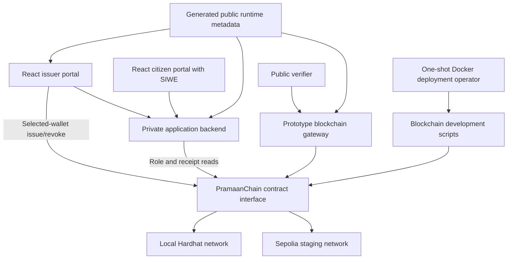
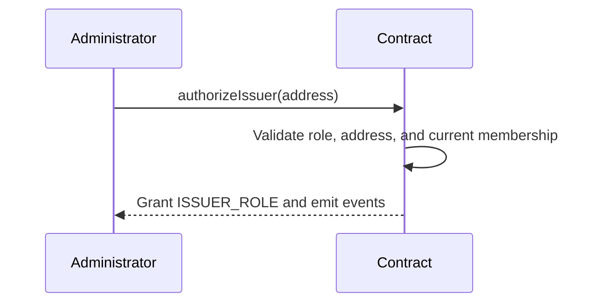
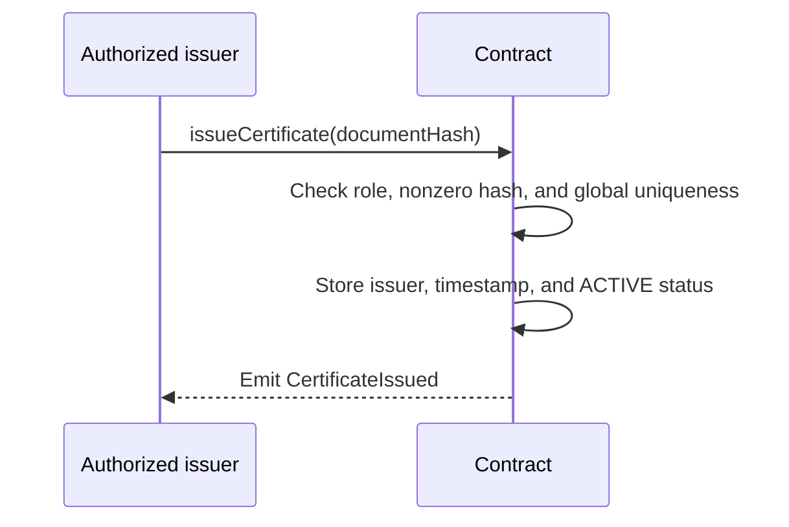
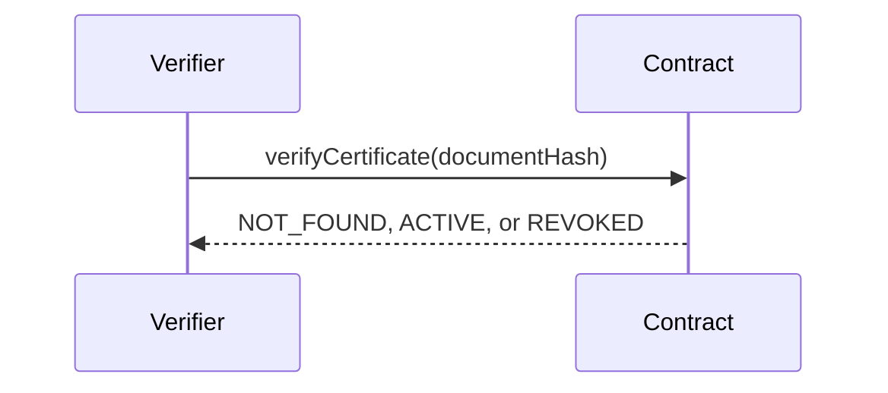
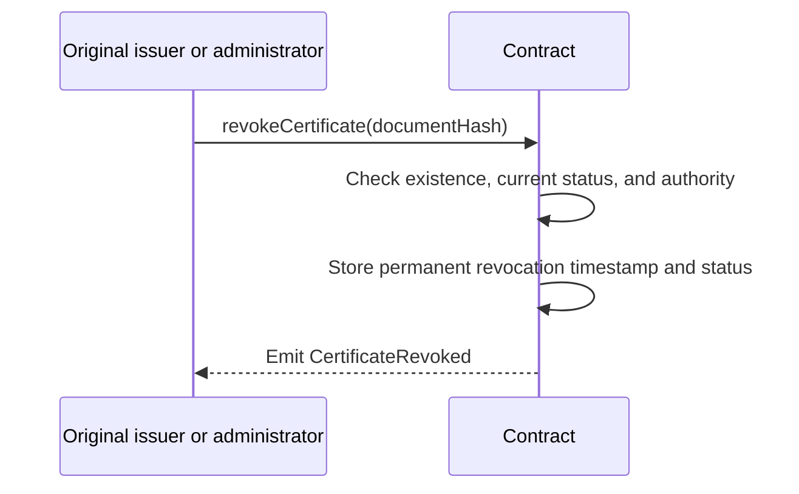
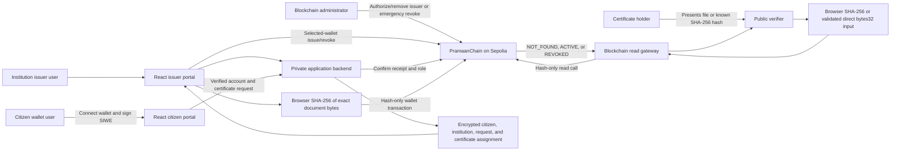
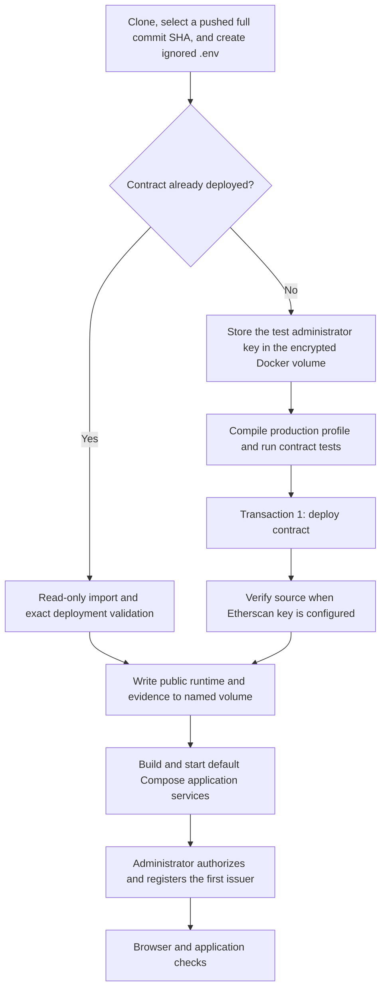

# PramaanChain Full System Architecture (Archived)

## 1. Purpose

PramaanChain is a certificate-verification system. Authorized institutions
anchor certificate proofs, and a verifier can determine whether a matching
certificate is active, revoked, or unknown.

The blockchain is a permanent proof registry. It stores a SHA-256 document
hash and necessary blockchain metadata, not the certificate file or the
citizen's personal information.

This document defines the blockchain component and the explicitly approved
prototype application integration. The private application backend and React
portal remain separate from the contract and blockchain gateway even though
they now live in the same repository. Production infrastructure and the
remaining deferred features are not part of this prototype.

This file is the versioned architecture source of truth. The independently
controlled Sepolia reproduction procedure is defined in
[`DOCKER_DEMO.md`](../DOCKER_DEMO.md).

## 2. Current Status and Confirmed Technology

The complete blockchain roadmap, Stages 1 through 11, is implemented, tested,
demonstrated, documented, and committed in the `blockchain/` repository. The
original reviewed contract is deployed and source-verified on Sepolia. The
repository also supports a fresh independent Sepolia deployment in which the
new deployer receives `ADMIN_ROLE` and does not depend on the original
administrator.

The independent workflow is reproducible infrastructure, not a second
preconfigured deployment. A new contract exists only after an operator
deliberately completes the required test gate and runs the state-changing
Sepolia command.

Confirmed technology and constraints:

- Ethereum Virtual Machine compatible blockchain
- Solidity `0.8.28`
- Hardhat 3 with JavaScript tests and scripts
- ethers.js through the Hardhat toolbox
- OpenZeppelin Contracts `AccessControl`
- Local Hardhat network for fast, deterministic development
- Ethereum Sepolia, chain ID `11155111`, for public application staging
- Etherscan-verified Sepolia deployment at
  `0x0bb21729BBDaBe54A289A1e924941F8F635Cab84`
- Non-upgradeable smart contract with no external calls
- Prototype Express and ethers.js Sepolia gateway on the `defy` branch
- Private Express, SIWE, encrypted SQLite application backend
- React/Vite public verifier, issuer portal, and citizen portal
- EIP-6963 browser-wallet discovery and WalletConnect mobile login
- Selected-wallet signing for administrator and issuer Sepolia transactions
- Docker Compose for reproducible local application operation
- Separate, profile-gated Docker deployment tools using Hardhat's encrypted
  keystore and generated public runtime metadata

Ethereum documents Sepolia as the recommended default testnet for smart-
contract and application development:
<https://ethereum.org/developers/docs/networks/>.

## 3. Scope

Completed local blockchain scope:

- Contract interface and storage design
- Administrator and issuer access control
- Unique certificate-hash issuance
- Public certificate lookup and status verification
- Permanent revocation
- Complete automated contract tests and coverage
- Repeatable local deployment and lifecycle demonstration
- Contract and backend-handoff documentation

Completed Sepolia blockchain scope:

- Secure Sepolia configuration
- Dedicated test administrator and issuer wallets
- Independent internal readiness review
- Sepolia deployment and synthetic lifecycle demonstration
- Etherscan source verification and deployment evidence
- Reproducible teammate-owned deployment and configuration procedure
- Required pre-deployment and post-configuration test gates

Still outside scope:

- Production citizen/institution application hosting and operations
- Production database backup, recovery, and key rotation
- Wallet recovery, address rotation, and certificate-file delivery
- On-chain citizen ownership proof
- Certificate or personal-data storage
- Production key management, monitoring, or deployment
- Ethereum mainnet deployment
- Upgradeability, batching, and zero-knowledge proofs

## 4. Component Boundary



The contract, Hardhat environment, blockchain gateway, private application
backend, and frontend remain separate security components. The gateway
provides public contract reads and event indexing. The application backend
provides SIWE, encrypted private relationships, request concurrency, and
independent transaction confirmation. The browser hashes exact file bytes and
authorized issuer wallets sign writes directly. The contract never receives
or stores the original document.

## 5. Deployment Environments

| Environment | Purpose | Chain ID | State |
| --- | --- | ---: | --- |
| Local Hardhat | Development, automated tests, repeatable demonstration | `31337` | Completed; resets when the node restarts |
| Original reviewed Sepolia deployment | Public staging reference and historical evidence | `11155111` | Deployed and Etherscan-verified at `0x0bb21729BBDaBe54A289A1e924941F8F635Cab84` |
| Independent Sepolia deployment | Teammate or reviewer-owned end-to-end demo | `11155111` | Created only when that operator runs the checked deployment; address and start block come from its output |
| Ethereum mainnet or production EVM | Real institutional operation | Network-specific | Deferred; requires new design approval |

Local addresses and transaction hashes are never deployment configuration for
Sepolia. Sepolia addresses and transactions are public and persistent but must
still be labeled testnet-only. The original and independent deployments do not
share roles, records, addresses, or event-index history. No production address
currently exists.

## 6. Actors, Wallets, and Permissions

### Contract administrator

The deployer receives `ADMIN_ROLE`. The administrator can:

- Authorize an issuer address
- Remove an issuer's authorization
- Revoke any certificate in an emergency

The administrator does not automatically receive `ISSUER_ROLE`. Administrator
membership is fixed in this contract version because direct role-management
functions are disabled.

### Authorized issuer

An authorized issuer can:

- Issue a new unique certificate hash
- Revoke a certificate originally issued by the same address
- Read certificate records and statuses

Removing an issuer prevents future issuance. It does not change existing
certificate records and does not prevent the removed original issuer from
revoking its earlier certificates.

### Public verifier

Any provider, account, or application can:

- Check whether a document hash exists
- Read its non-sensitive blockchain metadata
- Determine whether it is `ACTIVE`, `REVOKED`, or `NOT_FOUND`

No signer or transaction is required for verification.

### Sepolia wallet model

Every Sepolia deployment starts with a dedicated test-only
administrator/deployer wallet. Its address receives `ADMIN_ROLE` for that new
contract. Normal Docker deployment requires no issuer address or issuer key.
After application startup, the administrator authorizes a separate test-only
issuer through the browser-wallet onboarding flow. The optional legacy
synthetic lifecycle prepares both wallets before running its four transactions.

The original reference wallets remain controlled by the original blockchain
lead. An independent operator creates and controls a new pair and therefore
does not need either original private key or administrator approval.

Neither wallet may be a personal wallet, a mainnet wallet, or a wallet reused
by another project. Private keys must not be shared with collaborators,
provided in chat, printed in logs, or committed. Each wallet should hold only
the Sepolia ETH required for the approved transactions.

Before any production use, administrator control must move to an
organization-managed multisignature design reviewed as part of a new security
architecture.

## 7. Implemented On-Chain Data Model

The SHA-256 document hash is the mapping key and unique certificate identifier.
It is not stored redundantly in the record.

```solidity
enum CertificateStatus {
    NOT_FOUND,
    ACTIVE,
    REVOKED
}

struct Certificate {
    address issuer;
    uint64 issuedAt;
    uint64 revokedAt;
    CertificateStatus status;
}

mapping(bytes32 documentHash => Certificate certificate) private _certificates;
```

Status values are stable ABI integers:

| Value | Status | Meaning |
| ---: | --- | --- |
| `0` | `NOT_FOUND` | The hash has never been issued |
| `1` | `ACTIVE` | The hash was issued and has not been revoked |
| `2` | `REVOKED` | The certificate was permanently revoked |

The only allowed state transitions are:

```text
NOT_FOUND --issueCertificate--> ACTIVE --revokeCertificate--> REVOKED
```

There is no edit, deletion, reactivation, or reissuance path.

## 8. Privacy Boundary

Local development state is temporary, but Sepolia and production EVM state,
transaction calldata, and events are publicly readable. The contract must
never store or emit:

- Citizen name
- Citizenship or government identification number
- Date of birth
- Phone number or email address
- Home address
- Certificate file, marks, or contents
- Detailed revocation reason
- Any other personally identifiable information

Only the document hash, issuer address, timestamps, status, role metadata, and
necessary transaction metadata may appear on-chain.

A document hash is a stable fingerprint, not encryption. Low-entropy or
predictable input may be guessable, and anyone possessing a document can hash
it for comparison. Original documents and personal data remain off-chain under
the external backend's separate access-control, encryption, retention, and
deletion policies.

## 9. Implemented Contract Interface

```solidity
authorizeIssuer(address issuer)
removeIssuer(address issuer)
isAuthorizedIssuer(address issuer) returns (bool)
issueCertificate(bytes32 documentHash)
getCertificate(bytes32 documentHash) returns (Certificate)
verifyCertificate(bytes32 documentHash) returns (CertificateStatus)
revokeCertificate(bytes32 documentHash)
```

Inherited read functions such as `hasRole`, `getRoleAdmin`, and
`supportsInterface` remain available. Inherited `grantRole`, `revokeRole`, and
`renounceRole` are overridden and always revert so role changes cannot bypass
the domain rules and events.

The deployer receives `ADMIN_ROLE`; no account receives
`DEFAULT_ADMIN_ROLE`. `ISSUER_ROLE` reports `ADMIN_ROLE` as its administrator.

## 10. Business Rules

1. The deployer initially receives the administrator role.
2. Only an administrator can authorize or remove issuers.
3. The zero address cannot be authorized as an issuer.
4. Only an authorized issuer can issue a certificate.
5. A zero document hash cannot be issued.
6. A document hash can be issued only once, including after revocation.
7. An issued certificate record cannot be edited.
8. Only the original issuer or an administrator can revoke a certificate.
9. A nonexistent certificate cannot be revoked.
10. A certificate cannot be revoked more than once.
11. Revocation is permanent.
12. Removing an issuer prevents future issuance by that address.
13. Removing an issuer does not delete or invalidate earlier certificates.
14. A removed original issuer may revoke its earlier certificates.
15. Anyone can perform read-only lookup and verification.
16. Verification distinguishes `ACTIVE`, `REVOKED`, and `NOT_FOUND`.
17. State and events contain no document contents or personal information.

## 11. Events and Errors

Application events:

```solidity
IssuerAuthorized(address indexed issuer, address indexed administrator)
IssuerRemoved(address indexed issuer, address indexed administrator)
CertificateIssued(bytes32 indexed documentHash, address indexed issuer, uint64 issuedAt)
CertificateRevoked(bytes32 indexed documentHash, address indexed issuer, address indexed revokedBy, uint64 revokedAt)
```

OpenZeppelin `RoleGranted` and `RoleRevoked` are also emitted during issuer
changes. The application should use the four domain events as its stable
business interface.

Contract-specific errors:

```solidity
InvalidIssuerAddress()
IssuerAlreadyAuthorized(address issuer)
IssuerNotAuthorized(address issuer)
InvalidDocumentHash()
CertificateAlreadyExists(bytes32 documentHash)
CertificateNotFound(bytes32 documentHash)
CertificateAlreadyRevoked(bytes32 documentHash)
UnauthorizedRevoker(address account, bytes32 documentHash)
DirectRoleManagementDisabled()
```

OpenZeppelin `AccessControlUnauthorizedAccount` reports missing administrator
or issuer permissions.

## 12. Security Requirements

- Use OpenZeppelin `AccessControl`; never use `tx.origin`.
- Avoid external calls. If any are approved later, follow
  checks-effects-interactions and reassess reentrancy risk.
- Treat `block.timestamp` as approximate blockchain metadata, not an exact
  clock or clock-sensitive authorization source.
- Keep the contract non-upgradeable and unpaused unless a later reviewed design
  changes that decision.
- Compile, test, and deploy the exact independently reviewed commit.
- Require contract, gateway, application-backend, frontend unit, lint, and
  production-build checks to pass before an independent Sepolia deployment.
- Validate the connected chain ID before any public-network transaction.
- Wait for successful receipts; a submitted transaction hash is not proof of a
  successful state transition.
- Use synthetic document data only on Sepolia.
- Never expose secrets through code, Git, logs, screenshots, reports, shell
  history, CI artifacts, or support messages.
- Stop after an ambiguous or failed public write; diagnose read-only before
  considering another transaction.

## 13. Sepolia Configuration and Secret Management

Hardhat 3 configuration variables resolve lazily and can be backed by
environment variables or the encrypted `hardhat-keystore` plugin. The encrypted
keystore is the required default for local operator use:
<https://hardhat.org/docs/guides/configuration-variables>.

The normal manual deployment command resolves:

```dotenv
SEPOLIA_RPC_URL=placeholder
DEPLOYER_PRIVATE_KEY=placeholder
```

`ISSUER_PRIVATE_KEY` is required only by the optional four-transaction
`sepolia:deploy-demo` lifecycle. `ETHERSCAN_API_KEY` is conditionally required
for source verification, not for compilation, tests, or deployment.

The committed `.env.example` files label each variable as `REQUIRED`,
`OPTIONAL`, or `CONDITIONALLY REQUIRED` and contain placeholders only. `.env`
and `.env.*` remain ignored. Stage 10 added pinned `dotenv` loading for the
optional plaintext fallback without overriding already exported values.
CI/CD must obtain secrets from repository secrets or another approved secret
manager. No workflow may echo their values.

The Hardhat Sepolia profiles are separated by capability:

```text
sepolia: read-only RPC and source verification
sepolia-admin: account 0 is DEPLOYER_PRIVATE_KEY
sepolia-demo: account 0 is DEPLOYER_PRIVATE_KEY,
              account 1 is ISSUER_PRIVATE_KEY
```

All three profiles are HTTP, L1, and chain ID `11155111`. The Etherscan
verifier uses `ETHERSCAN_API_KEY`. Deployment and verification must use the
same production build profile and compiler settings. Hardhat's verification
workflow is documented at
<https://hardhat.org/docs/guides/smart-contract-verification>.

The recommended Docker workflow stores `DEPLOYER_PRIVATE_KEY` and the optional
`ETHERSCAN_API_KEY` only in the named encrypted `hardhat_keystore` volume.
`.env` supplies the RPC and public application settings but must never
contain wallet keys. Only the one-shot services behind Compose's `deploy`
profile mount the keystore. The long-running gateway, private backend, and
frontend do not mount it and do not receive wallet keys through their
environments.

An independent deployment produces public configuration rather than secrets:

| Output | Consumer |
| --- | --- |
| Chain ID | Gateway, application backend, and frontend |
| Contract address | Gateway, application backend, and frontend |
| Deployment block | Gateway event index |
| Administrator address | Administrator login and post-start issuer onboarding |
| Transaction hashes | Receipt validation and public evidence |

Every component must use the same new contract address. The gateway must start
indexing at that contract's reported deployment block, not at the original
reference block.

The Docker operator writes this public identity atomically to `runtime.env`
and evidence to `deployment.json` in the named `deployment_state` volume. This
avoids host-UID assumptions while keeping the runtime readable by non-root
application containers. Both files contain public identifiers and transaction
evidence; application entrypoints load only allowlisted runtime values. The
volume is mounted read-only by the gateway, private backend, and frontend. An
existing deployment may populate it only after read-only
validation of chain ID, exact compiled runtime bytecode, the successful
contract-creation receipt in the supplied deployment block, and current
administrator role. Older runtime files may contain an optional issuer address,
but new deployment and import flows do not require or generate one.

## 14. Main Contract Flows

### Issuer authorization



### Certificate issuance



### Public verification



### Certificate revocation



## 15. End-to-End User and System Flow

This section describes how users and the prototype application components
interact with the deployed blockchain component. The issuer portal, verifier,
application authentication, and encrypted database are separate from the
smart contract. Their inclusion here defines the integration boundary; it does
not claim that the smart contract implements those features.

### 15.1 Original reviewed Sepolia integration reference

| Item | Public testnet value |
| --- | --- |
| Network | Ethereum Sepolia |
| Chain ID | `11155111` |
| Contract | `0x0bb21729BBDaBe54A289A1e924941F8F635Cab84` |
| Deployment block | `11318772` |
| Deployment commit | `73a711d0694197e70e2c262fffd587183c7414fa` |
| Administrator | `0x3537d004295AF62098e63DCF6bB8A7c6dAaCB447` |
| Current test issuer | `0x4e02876F9bfd58f9D2D542F9520055BeD3addd28` |
| ABI artifact | `blockchain/artifacts/contracts/PramaanChain.sol/PramaanChain.json` |
| Explorer | <https://sepolia.etherscan.io/address/0x0bb21729BBDaBe54A289A1e924941F8F635Cab84#code> |

These values identify the original reviewed deployment and its historical
evidence. An independently deployed application must replace the contract,
deployment block, administrator, and issuer values with its own command
output. Mixing values from two deployments is invalid.

The ABI is the artifact's `abi` property. Generate it from the reviewed build
with `npx hardhat compile --build-profile production` in `blockchain/`.
Generated artifacts are ignored by Git, so the backend release process must
generate or securely package the ABI.

### 15.2 Overall interaction flow



The original certificate and personal information stay outside the blockchain
path. Only the SHA-256 digest, signer addresses, status, timestamps, events,
and normal transaction metadata are public on-chain.

### 15.3 Citizen wallet login and private assignment mapping

The implemented prototype uses a citizen wallet for authentication but does
not store the citizen wallet or assignment in the smart contract.

The login nonce below is a short-lived authentication challenge. It is
different from the Ethereum transaction nonce that ethers manages for the
issuer wallet and from the HTTP `Idempotency-Key` used to deduplicate
issue/revoke requests.

1. The citizen selects a discovered EIP-6963 browser wallet or connects a
   WalletConnect-compatible mobile wallet. The portal displays the selected
   public address, current network, and optional balance. Balance lookup is
   presentational and cannot block authentication. The user may change the
   exposed account, and the frontend may request or add the public Sepolia
   network metadata.
2. Wallet connection alone is not login. Only a separate **Sign in with
   Ethereum** action asks the backend for a five-minute, single-use EIP-4361
   SIWE challenge.
3. The citizen signs the exact message. The backend verifies it and derives
   capabilities from current contract and private-database state; it never
   trusts a role supplied by the frontend.
4. A wallet without a citizen relationship is `UNLINKED` and may connect to an
   institution using its stable public ID. Connection requires no institution
   approval or secret code and occurs in one atomic, idempotent database
   transaction.
5. The citizen may connect to multiple institutions and submit a request to
   any connected institution.
6. The backend creates a unique request that relates the citizen account to
   exactly one institution:

   ```text
   requestId -> citizenId -> institutionId -> certificateType -> status
   ```

7. An institution employee sees only requests assigned to that employee's
   authenticated institution. The employee does not search a global list of
   citizen wallets or manually type a recipient address.
8. After issuance, the backend stores the private relationship:

   ```text
   certificateId -> requestId -> citizenId -> institutionId
                 -> documentHash -> transactionHash -> blockchain status
   ```

9. The citizen reconnects the same wallet and signs a new SIWE challenge to view the
   certificates associated with that private backend account.

Only issuer wallets receive an on-chain role from the administrator. Citizen
wallets do not need administrator authorization, do not pay gas for viewing or
verification, and are never passed to `issueCertificate`. A citizen must never
provide a private key or seed phrase. Wallet recovery and address rotation must
be handled by a separately approved backend account-recovery policy.

### 15.4 Issuer onboarding and authentication flow

1. An on-chain administrator signs into the application with SIWE.
2. The administrator chooses an immutable public institution ID, display name,
   and one primary issuer wallet.
3. If needed, the administrator's selected wallet sends
   `authorizeIssuer(issuerAddress)` on Sepolia and waits for confirmation.
4. The private backend independently verifies authorization, then stores the
   institution and encrypted primary issuer membership.
5. The issuer signs a SIWE challenge in the selected browser or mobile wallet.
6. For every protected action, the application backend requires both current
   institution membership and `isAuthorizedIssuer(address) == true`. An old
   eight-hour session does not preserve removed authorization.

The application backend holds neither administrator nor issuer private keys.
Administrator transactions remain explicit browser-wallet actions.

### 15.5 Certificate issuance flow

1. An authenticated institution user selects a pending request assigned by
   the backend to that user's institution.
2. The browser hashes the exact raw certificate bytes with SHA-256. The result
   must be `0x` followed by 64 hexadecimal characters and maps directly to
   Solidity `bytes32`.
3. The application backend atomically freezes the request and hash using
   `PENDING -> PROCESSING`. Concurrent attempts cannot select another hash.
4. The application may call `verifyCertificate(documentHash)` for early feedback,
   but this read does not replace the contract's write-time uniqueness check.
5. The authorized issuer wallet sends `issueCertificate(documentHash)`.
6. The contract checks the issuer role, rejects a zero or previously used
   hash, stores the issuer and approximate block timestamp, marks the record
   `ACTIVE`, and emits `CertificateIssued`.
7. The backend independently validates the chain, contract, sender, successful
   receipt, event, hash, and `ACTIVE` state, then atomically changes
   `PROCESSING -> ISSUED`.
8. The backend links the confirmed certificate record to the request, citizen
   account, and issuing institution. This relationship remains private and
   off-chain.
9. Certificate delivery to the holder remains an external application flow;
   the certificate file is never retrieved from the blockchain.

### 15.6 Public verification flow

1. A verifier receives the certificate file or its known SHA-256 hash from the
   holder or another legitimate off-chain source.
2. For a file, the browser calculates SHA-256 over the same exact raw bytes
   used at issuance. The file does not leave the verifier's device. For direct
   input, the browser requires `0x` followed by exactly 64 hexadecimal
   characters.
3. A provider-only connection calls `verifyCertificate(documentHash)`. No
   wallet, private key, transaction, or ETH is required.
4. The application maps the returned ABI integer:
   - `0` to `NOT_FOUND`;
   - `1` to `ACTIVE`; and
   - `2` to `REVOKED`.
5. When issuer and timestamp metadata are needed, the application also calls
   `getCertificate(documentHash)`.
6. The application displays the status without claiming that blockchain
   verification proves the holder's identity or ownership. A changed byte
   produces a different hash and normally returns `NOT_FOUND`.

### 15.7 Revocation and issuer-removal flows

For normal revocation:

1. The institution submits an authenticated revocation request through the
   external backend.
2. The application rechecks current institution membership, current
   authorization, and exact equality between the connected wallet and the
   certificate's immutable on-chain issuer.
3. The original issuer wallet sends `revokeCertificate(documentHash)`. The
   administrator may perform a separately controlled emergency revocation.
4. After a successful receipt, the backend confirms that
   `verifyCertificate(documentHash)` returns `REVOKED`.
5. Revocation is permanent. The hash cannot be reissued or restored.

The application deliberately blocks a removed issuer from revoking through
the UI, although the deployed contract still permits the removed original
issuer to call revocation directly. For issuer removal:

1. The administrator sends `removeIssuer(issuerAddress)` through the separate
   administrative process.
2. After confirmation, the removed address cannot issue new hashes.
3. Earlier certificates remain valid according to their stored status.
   Contract-level direct revocation by that removed original issuer remains
   possible under the deployed contract's immutable rules.

### 15.8 Backend reliability and security rules

- Validate chain ID `11155111`, the configured contract address, and deployed
  bytecode before enabling Sepolia operations.
- Keep RPC credentials and signer keys in a secret manager. Never expose them
  to browsers, mobile applications, logs, error responses, or source control.
- Separate the administrator signer from routine issuer operations.
- Enforce institution-scoped access so an issuer sees only its institution's
  requests and certificates. A wallet address alone is not verified civil
  identity.
- Send only a document hash to the contract. Never put a filename, document,
  citizen identity, contact information, marks, or revocation reason in
  calldata or transaction metadata.
- Treat the contract's duplicate-hash and authorization checks as
  authoritative even when the backend performs preflight reads.
- Do not mark a write successful from its transaction hash alone. Wait for a
  successful receipt and make the confirmation depth configurable.
- If a write times out or becomes ambiguous, query its transaction hash,
  signer nonce, emitted events, and current contract state before retrying.
  Never automatically submit a possibly duplicated write.
- Bound individual RPC requests and receipt waits. Reset the managed signer
  nonce only after a definite pre-broadcast failure; never reset it merely
  because confirmation became ambiguous.
- Persist write idempotency records for the single-process prototype so a
  restart cannot silently duplicate an unresolved operation. Multi-process
  signing still requires a database-backed shared queue.
- Decode contract custom errors through the reviewed ABI and return safe
  domain messages instead of raw provider or secret-bearing errors.
- Index the four domain events from the configured contract's deployment
  block. The original reference uses `11318772`; an independent deployment
  must use the block reported by its own deployment command.
- Start the HTTP service after mandatory chain and bytecode checks, then build
  the historical index in the background. Report index degradation separately
  from direct blockchain-read health and retry failed indexing with bounded
  exponential backoff.

### 15.9 Independent Sepolia deployment and startup flow

The Docker-first workflow separates optional contract setup from repeatable
application startup:



The contract-tools image is built from the exact full `SOURCE_COMMIT` fetched
from the project Git repository, labeled with that revision, and built with
BuildKit provenance. Its runtime rejects a source revision that differs from
the embedded build revision. The `deploy-contract` one-shot service then
compiles the production profile and runs all contract tests before any write.
It deploys one new contract, sending exactly one transaction. Issuer
authorization, issuance, and revocation are excluded from infrastructure setup
and remain explicit browser-wallet actions. The deployment output contains the
source commit, deployed-bytecode hash, new contract address, deployment block,
administrator, deployment transaction hash, and source-verification status.

The `configure-existing` service is an alternative, read-only path. It
requires the exact contract address, deployment block, and administrator and
writes runtime metadata only after validating them on Sepolia.

Once runtime metadata exists in `deployment_state`, a normal
`docker compose up --build -d` starts the gateway, private backend, and
frontend without deployment services. The startup path cannot send a
contract-setup transaction. Published ports bind to loopback by default.
Long-running services use non-root users, read-only root filesystems, dropped
capabilities, and `no-new-privileges`; their writable state is limited to
named volumes and temporary filesystems. Non-loopback use requires a separate
HTTPS ingress review and secure cookies.

Deployment recovery is read-only and transaction-aware. It resolves the
recorded deployment hash, receipt, transaction and administrator nonce.
Successful contract creation is finalized only after revalidating exact
runtime bytecode, the deployment receipt and block, and the administrator
role. Pending, failed, ambiguous or inconsistent evidence is blocked and never
causes an automatic replacement deployment.

After deployment, configuration ownership is:

| Component | Required independent values | Prohibited values |
| --- | --- | --- |
| Docker/Hardhat one-shot operator | RPC, encrypted administrator key; Etherscan key for verification | Issuer key, personal or mainnet wallet credentials |
| Public gateway | RPC, generated contract address, generated deployment block, browser CORS origin | Administrator key, issuer key, deployment keystore |
| Private application backend | RPC, generated contract address, persistent database encryption key | Administrator key, issuer key, deployment keystore, frontend secrets |
| Frontend | New contract address and public service URLs; WalletConnect project ID only when mobile QR is enabled | RPC credentials, wallet keys, database key, write API key |

The private backend generates its application-data encryption key on first
container start and stores it with the SQLite database in the persistent
`app_data` volume. The gateway's persistent event/idempotency state uses a
separate volume. Public deployment identity uses `deployment_state`; the
administrator and optional Etherscan secrets use the separate encrypted
`hardhat_keystore` volume. A tightly scoped one-shot initializer
sets ownership on the two deployment volumes, so the workflow is independent
of the host user's UID. Removing Compose volumes destroys those local values
but does not alter Sepolia.

The exact Docker and manual npm commands, placeholders, recovery rules, and
application walkthrough are maintained in
[`DOCKER_DEMO.md`](../DOCKER_DEMO.md). Running the
state-changing deployment profile is an explicit operator action; normal
application startup never enters that profile.

## 16. Project Structure

```text
blockchain/
├── app-backend/
│   ├── src/
│   └── test/
├── backend/
│   ├── src/
│   │   ├── middleware/
│   │   ├── routes/
│   │   ├── services/
│   │   └── utils/
│   ├── test/
│   ├── .env.example
│   └── package.json
├── __frontend/
│   ├── public/
│   └── src/
├── contracts/
│   └── PramaanChain.sol
├── docker/
│   ├── app-backend.Dockerfile
│   ├── app-backend-entrypoint.js
│   ├── contract-tools.Dockerfile
│   ├── frontend.Dockerfile
│   ├── frontend-entrypoint.sh
│   ├── gateway.Dockerfile
│   ├── gateway-entrypoint.js
│   ├── load-runtime-env.js
│   ├── nginx-main.conf
│   └── nginx.conf
├── test/
│   ├── DeploymentProfiles.test.js
│   ├── DeploymentRecovery.test.js
│   ├── DeploymentRuntime.test.js
│   ├── NetworkSafety.test.js
│   └── PramaanChain.test.js
├── scripts/
│   ├── configure-existing.js
│   ├── deploy.js
│   ├── deploy-contract.js
│   ├── deployment-recovery.js
│   ├── deployment-runtime.js
│   ├── deployment-validation.js
│   ├── demo.js
│   ├── docker-deploy.js
│   ├── export-deployment.js
│   ├── resume-deployment.js
│   └── network-safety.js
├── docs/
│   ├── README.md
│   ├── DOCKER_DEMO.md
│   ├── SYSTEM_ARCHITECTURE.md
│   ├── APPLICATION_GUIDE.md
│   ├── CONTRACT_GATEWAY_INTEGRATION.md
│   ├── BACKEND_ARCHITECTURE_AND_API.md
│   ├── BACKEND_SAMPLES.md
│   ├── CONTRACT_DESIGN.md
│   ├── CRYPTOGRAPHY_ENGINE.md
│   ├── FRONTEND_INTEGRATION.md
│   └── archive/
│       ├── README.md
│       ├── CRYPTOGRAPHY_ENGINE_PROTOTYPE.md
│       ├── SEPOLIA_DEPLOYMENT.md
│       ├── SEPOLIA_PREPARATION.md
│       ├── STAGE10_VALIDATION.md
│       ├── STAGE8_DEMONSTRATION.md
│       └── STAGE9_VALIDATION.md
├── hardhat.config.js
├── compose.yaml
├── .dockerignore
├── .env.docker.example
├── package.json
├── package-lock.json
├── .gitignore
├── .env.example
└── README.md
```

Historical preparation, validation, and deployment reports are preserved in
`docs/archive/`. Generated artifacts, caches, coverage output, dependencies,
`.env` files, and keystore material are not tracked.

## 17. Roadmap and Approval Gates

Completed local stages:

1. Local Hardhat environment
2. Contract design
3. Issuer access control
4. Certificate issuance
5. Lookup and verification
6. Certificate revocation
7. Complete contract tests
8. Local deployment and demonstration
9. Documentation and backend handoff

Completed Sepolia stages:

10. Sepolia configuration and independent internal readiness review
11. Separately approved Sepolia deployment, full synthetic lifecycle, and
    Etherscan verification

Stage 10 sent no project-signed Sepolia transaction. The original Stage 11
began only after
an independent reviewer marked the exact candidate commit `PASS` and Prabin
explicitly approved the deployment. The reviewed commit was deployed, its
synthetic lifecycle completed, and its source was verified on Etherscan.

An independently operated demo does not inherit the original deployment's
administrator, review record, address, or evidence. Its operator must pass the
documented tests, use dedicated test-only wallets, record its own commit and
public outputs, and deliberately initiate its own Sepolia transactions. No
tool or startup command deploys automatically.

## 18. Independent Review and Deployment Evidence

The Stage 10 reviewer was independent of both implementation and deployment.
The readiness record includes:

- Reviewer and date
- Exact candidate commit SHA
- Contract, permission, privacy, script, dependency, and configuration review
- Clean compilation, test, coverage, and secret-scan results
- Findings and their disposition
- Final `PASS` or `BLOCKED` conclusion

The completed Stage 11 public evidence record includes:

- Sepolia chain ID and public RPC network name, but no credentialed RPC URL
- Contract, administrator, and issuer public addresses
- Reviewed commit, compiler version, and build profile
- Deployment, authorization, issuance, and revocation transaction hashes and
  blocks
- `ACTIVE` and `REVOKED` read results for the synthetic hash
- Etherscan contract and transaction links
- Explicit confirmation that no secret or real certificate data was used

An external professional audit is not required for the fellowship Sepolia
prototype. It becomes mandatory before any production deployment involving
real institutions, real certificate operations, or assets.

## 19. Application Integration Contract

The implemented application integration uses:

- Deployed contract address for the selected chain
- Contract ABI generated from the reviewed build
- RPC URL and validated chain ID
- Administrator and issuer role definitions
- Function inputs, outputs, events, and custom errors
- Exact SHA-256 raw-byte canonicalization rules
- Signer custody and authorization mapping
- Receipt confirmation, retry, nonce, fee, and reorganization policies
- Event indexing start block and idempotent replay behavior
- One consistent contract address across the gateway, application backend, and
  frontend
- The selected contract's own deployment block rather than a global constant

The blockchain backend-handoff document defines the current interface.
Implementation details and local startup are documented in
`docs/APPLICATION_GUIDE.md`. Production operation remains a
separately reviewed responsibility.

## 20. Remaining Deferred Decisions

The Sepolia network and test wallet separation are resolved. These decisions
remain deferred and must not be silently assumed:

- Production EVM network and deployment process
- Organization-managed multisignature membership, threshold, recovery, and
  rotation
- Production issuer KMS, HSM, Vault, or equivalent custody
- Production confirmation, monitoring, incident-response, and upgrade strategy
- Citizen wallet recovery, rotation, delivery, and account-recovery policy
- Batch issuance, pausing, migration, or upgradeability

Zero-knowledge proofs are explicitly deferred and are not part of the selected
prototype architecture. The current design includes no ZK circuit, identity
commitment, Merkle-root registry, proof-generation workflow, or Solidity proof
verifier. ZK should be reconsidered only if a later approved requirement needs
a citizen to prove ownership or membership without revealing the citizen
wallet or certificate relationship. Such a change requires a new threat model,
contract and circuit design, independent review, and deployment approval.

Each production decision requires a separate threat model, professional audit,
and explicit approval.
